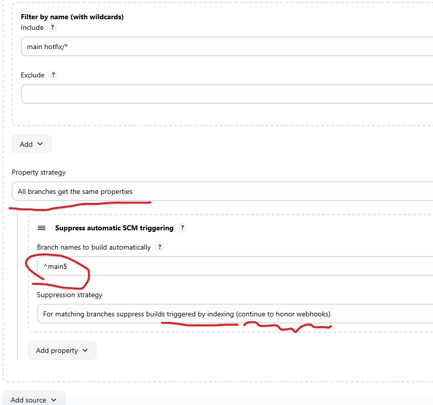

# Jenkins

## GitHub Webhook triggering


## Turn off triggering on scan

If you need to re-scan the pipeline to get new branches by default it would triggering all available branches which is not desirable.
To turn it off you need to add the property strategy `Suppress automatic SCM triggering` and set:
`For matching branches suppress builds triggering by indexing(continue to honor webhooks)`



But be careful because it would affect the `WebHooks` if you need to trigger build on `main` branch you need to add it to the regex: `^main$` so it would be triggered.

## Call cf command

```groovy

#!groovy


def login(url, org, space){

withCredentials([usernamePassword(credentialsId: env.CredsToUse, usernameVariable: 'uName', passwordVariable: 'password')]) {
	CONNECT = sh (
				script: "cf login -a ${url} -u \"${uName}\" -p \"${password}\" -o ${org} -s ${space}",
				returnStatus: true
			)
	sh """
		${env.PCF_COMMAND}
		"""
}
}

ansiColor('xterm') {

node {
	timeout(time: 30, unit: 'MINUTES') {

		stage('Preparation') {
			env.PATH = "/usr/sbin:$env.PATH"
			env.PATH = "/home/jenkins/bin:$env.PATH"
			env.PATH = "/apps/home/builder/bin:$env.PATH"

			env.LANG = "en_US.UTF-8"
			env.LC_ALL = "en_US.UTF-8"
			env.LANGUAGE = "en_US.UTF-8"

			def regionUrlFragment;
			switch(params.gcpRegion){
				case "us-central-1":
					regionUrlFragment = 'usc1'
					break
				case "us-west-1":
					regionUrlFragment = 'usw1'
					break
			}
			env.PCF_API =  params.pcfApiEndpoint
			env.PCF_ORG = params.pcfOrg
			env.PCF_SPACE = params.pcfSpace
			env.PCF_APP = params.pcfApp
			env.PCF_COMMAND = params.pcfCommand
		}
		// stage('Approve Route Changes'){
		//   input 'Please approve ClareityIAM Route management in production'
		// }
		stage('Exec')
		{
				login(env.PCF_API, env.PCF_ORG, env.PCF_SPACE)

		}

	}
}
}

```


## Touch the endpoint

```groovy
    stage('Stage 2') {
      steps {
        timeout(time: 1, unit: 'MINUTES') {
          waitUntil {
            script {
              echo 'This stage should succeed immediately if google.com is up, otherwise jenkins will retry until 1min runs out.'
              def status = sh script: 'wget -q https://google.com -O /dev/null', returnStatus: true
              return (status == 0)
            }
          }
        }
      }
    }
```

## Health checking

On the cloud you may need to check liveness of the Jenkins node. The best would be to install `Metrics` plugin and call: 
`/metrics/healthcheckOk` it should respond with `200` and with no payload.

```hsl
resource "aws_lb_target_group" "tg_jenkins" {
  name        = "tg-jenkins"
  port        = 8080
  protocol    = "HTTP"
  vpc_id      = var.vpc_id
  target_type = "ip"  # ECS Fargate requires "ip", for EC2 instances use "instance"

  health_check {
    path                = "/metrics/healthcheckOk"
    interval            = 120
    timeout             = 20
    healthy_threshold   = 5
    unhealthy_threshold = 4
    matcher             = "200"
  }


}
```


## GitHub Web hook

### On GitHub

- add webhook
- Use `application/json`
- add secret (random hard to guess token)
- Use custom events: Push and Pull

and you need the personal access token for your jenkins user to access repos. 
You can create your own personal access token in your account GitHub settings.
Token should be registered with scopes:
- `admin:repo_hook` - for managing hooks (read, write and delete old ones)
- `repo` - to see private repos
- `repo:status` - to manipulate commit statuses

You may create 2 separate personal tokens with and without hook support

### On Jenkins

On the Configuration/System

You need 3 things:

1) Credential as username/password with personal token and your GitHub username
That would be used to access repo on the app folders

2) The token with personal token which allow repo and repo_hook access
That would be used to allow access GitHub API on System settings

3) Web Hook secret for repo
- Register new credential as token
- ??? not sure where is should be used or may be should be properly named. It is used to auth callback call


### On the project folder

????