# Chat System Design

> **Interview question:** Design a chat system (like Slack / WhatsApp).
> Focus: Real-time delivery, message ordering, presence, search, history.

---

## Overview

Chat systems look deceptively simple — users send text, others receive it. In practice they are one of the hardest distributed systems to build correctly because they combine:

- **Persistent stateful connections** (WebSocket) that must be managed at scale
- **Strict ordering guarantees** within a conversation, across unreliable networks
- **Fan-out** — one message may need to reach thousands of members instantly
- **Offline delivery** — messages must not be lost when recipients are disconnected
- **Presence** — who is online, typing, or last seen — with low staleness
- **Search** — full-text across years of conversation history
- **Multi-device** — the same account on phone, desktop, and tablet simultaneously

Each of these is independently hard. Together, they require careful architectural boundaries.

---

## Core Terminology

| Term | Meaning |
|---|---|
| **Conversation** | A 1-on-1 or group chat container; holds all messages between participants |
| **Message** | An immutable unit of content with a globally unique ID and a sequence position |
| **Fan-out** | Delivering one message to all N members of a conversation |
| **Inbox** | Per-user storage of messages they should receive |
| **Presence** | Whether a user is currently online, idle, or offline |
| **Cursor** | Per-user pointer tracking how far they have read in a conversation |
| **ACK** | Acknowledgement that a message was delivered / read |

---

## Transport: How Clients Stay Connected

### Why Not Regular HTTP?

Regular HTTP is request-response — the server cannot push to a client without a request. For chat, the server must push new messages instantly. Three options:

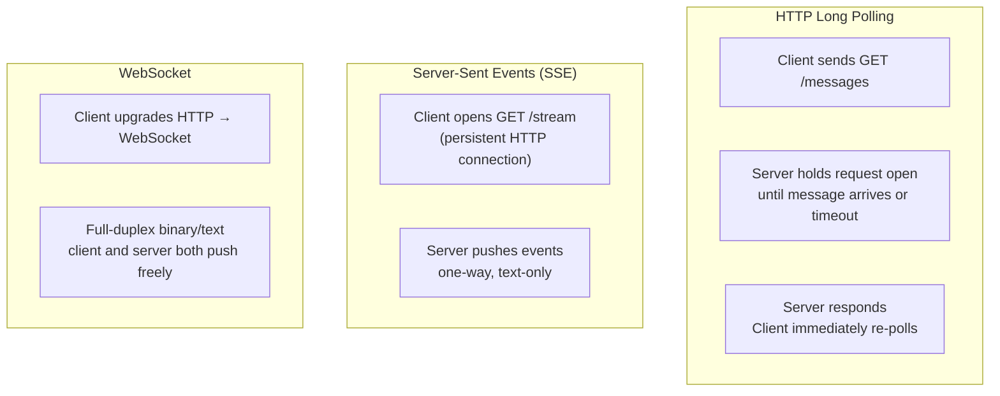

| Transport | Latency | Server Load | Bidirectional | Best For |
|---|---|---|---|---|
| Long polling | ~1s | High (many open sockets) | No | Legacy fallback |
| SSE | ~50ms | Medium | Server → client only | Notifications, feeds |
| **WebSocket** | ~10ms | Low (persistent conn) | Yes | Chat, games, collaboration |

**WebSocket is the standard for chat.** A single TCP connection stays open for the session lifetime. The client and server exchange framed messages in both directions without HTTP overhead.

### WebSocket Connection Lifecycle

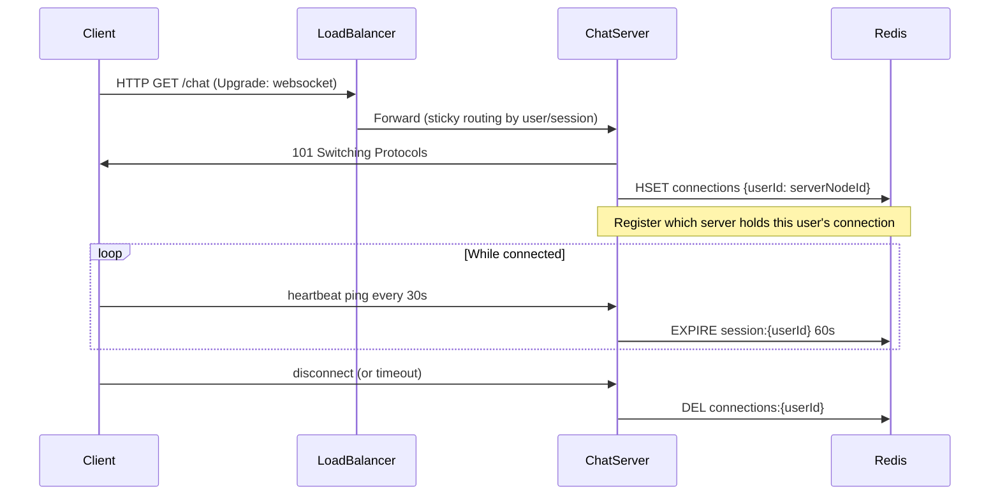

**Sticky routing** is critical — the load balancer must route all requests from the same user to the same chat server node (by userId cookie or consistent hashing). Otherwise the server doesn't know where to push messages.

---

## Message IDs and Ordering

### The Ordering Problem

Two users send messages at "the same time." Which appears first in the conversation? The answer must be **identical on every device** — otherwise conversations look different to different participants.

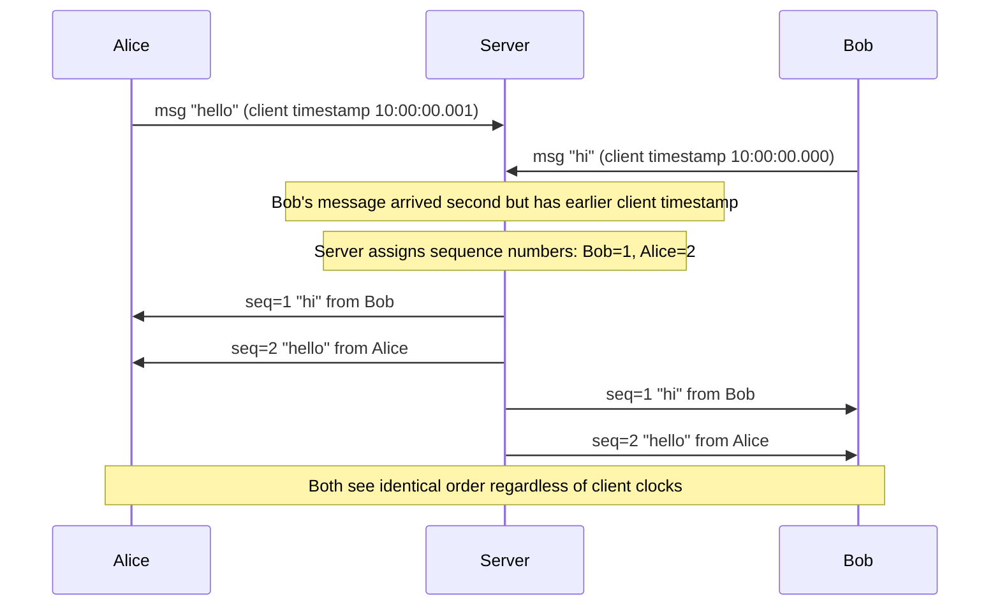

**Client timestamps are unreliable** (clocks drift, users can set them to anything). The server must be the authority on message ordering.

### Snowflake IDs

Twitter's Snowflake algorithm generates 64-bit IDs that are:
- **Time-ordered** (naturally sort by creation time)
- **Globally unique** (no coordination between nodes needed)
- **Fast** (~1 million IDs/sec per node)

```
63        22        12       0
|-- 41 bits --|- 10 bits -|- 12 bits -|
  timestamp    machine ID   sequence
  (ms since    (datacenter  (per-ms
   epoch)       + worker)    counter)
```

A Snowflake ID is both the message's **unique identifier** and its **chronological sort key**. No separate sequence column needed.

### Per-Conversation Sequence Numbers

For strict in-conversation ordering, assign a monotonically increasing sequence number per conversation (not global). This is simpler to reason about and avoids gaps:

```
conversation_id: conv_123
  seq=1: "hey"
  seq=2: "what's up?"
  seq=3: "not much"
```

**Implementation:** Atomic Redis counter per conversation (`INCR seq:conv_123`) or a Postgres sequence per conversation partition. The sequence number is assigned server-side before persisting.

---

## Storage

### Why Cassandra?

Chat message storage has a very specific access pattern:

- **Writes are append-only** — messages are immutable once sent.
- **Reads are sequential within a conversation** — paginate backward from the newest.
- **Never need ad-hoc queries** across conversations (no `WHERE content LIKE '%hello%'`).
- **High write throughput** — large group chats with 10K members generate bursts.
- **TTL / retention** — messages older than N days can be automatically expired.

Cassandra (and DynamoDB) excel at this exact pattern. PostgreSQL struggles with high-write append workloads at chat scale.

### Schema Design

```sql
-- Cassandra CQL

CREATE TABLE messages (
    conversation_id  UUID,
    message_id       BIGINT,        -- Snowflake ID (time-ordered)
    sender_id        UUID,
    content_type     TEXT,          -- 'text', 'image', 'file', 'system'
    content          TEXT,
    media_url        TEXT,
    reply_to_id      BIGINT,        -- for threaded replies
    edited_at        TIMESTAMP,
    deleted          BOOLEAN,
    created_at       TIMESTAMP,
    PRIMARY KEY (conversation_id, message_id)
) WITH CLUSTERING ORDER BY (message_id DESC)
  AND default_time_to_live = 31536000;  -- 1 year TTL
```

```sql
-- User's conversation list (inbox)
CREATE TABLE user_conversations (
    user_id          UUID,
    last_message_at  TIMESTAMP,
    conversation_id  UUID,
    unread_count     INT,
    last_read_seq    BIGINT,
    PRIMARY KEY (user_id, last_message_at, conversation_id)
) WITH CLUSTERING ORDER BY (last_message_at DESC);
```

**Partition key** = `conversation_id` → all messages of one conversation are co-located on the same Cassandra node(s). A time-range scan for "last 50 messages" is a single partition read.

---

## Message Delivery Pipeline

### Send Flow

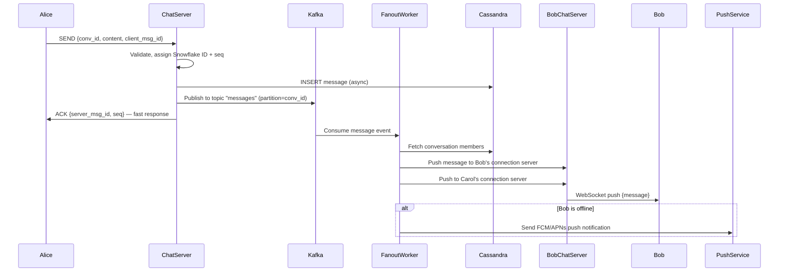

**Key design choices:**

1. The chat server ACKs Alice **before** fan-out completes. Alice's message is persisted; delivery to Bob happens asynchronously. This keeps Alice's UI responsive.
2. Kafka decouples message acceptance from delivery. If a fan-out worker crashes, the message is replayed from Kafka.
3. Fan-out workers look up members from Cassandra — the source of truth for group membership.

### Delivery Receipts

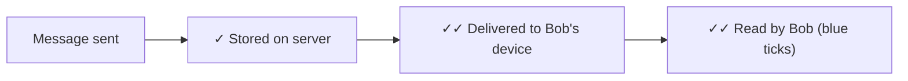

| Receipt | Trigger | Stored Where |
|---|---|---|
| Sent | Server ACKs to Alice | Implicit (message exists) |
| Delivered | Bob's device ACKs WebSocket push | `message_receipts` table |
| Read | Bob's app calls read API | `user_conversations.last_read_seq` |

Read receipts in group chats require per-member tracking:
```sql
CREATE TABLE message_receipts (
    conversation_id  UUID,
    message_id       BIGINT,
    user_id          UUID,
    status           TEXT,   -- 'delivered' | 'read'
    timestamp        TIMESTAMP,
    PRIMARY KEY ((conversation_id, message_id), user_id)
);
```

---

## Fan-Out Strategies

Fan-out is the hardest scaling problem in chat. When a message is sent to a group with 50,000 members (think a Discord server), you need to push it to every connected member instantly.

### Push Model (Write Fan-Out)

On each message, write to every member's inbox immediately.

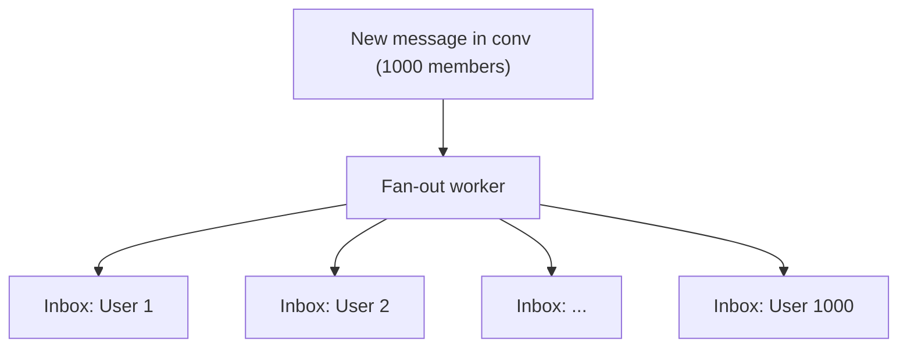

**Pros:** Reads are O(1) — user just reads their inbox.  
**Cons:** Write amplification — one message = N writes. A group with 100K members = 100K Cassandra writes.

### Pull Model (Read Fan-Out)

Store the message once in the conversation. Members read from the conversation directly.

**Pros:** Write is O(1).  
**Cons:** Read requires scanning the conversation since the user's last-read cursor. For very active conversations with 1M messages, this is expensive.

### Hybrid Model (WhatsApp / Slack approach)

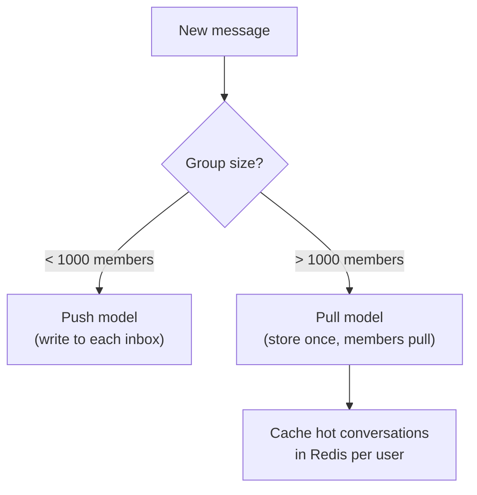

- Small groups (1-on-1, small teams): push to each member's inbox → O(1) reads.
- Large channels (>1K members): store once, fan-out only to **online members** now, offline members pull on reconnect.

---

## Presence System

Presence answers: "Is this user online? When were they last seen?"

### Heartbeat-Based Presence

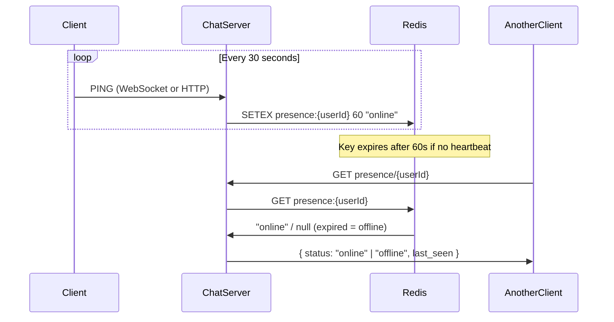

**Last seen timestamp** is stored in a separate persistent key (not TTL-expired):
```
HSET user:{userId}:meta last_seen 1716892800
```

This is updated every time the presence key expires (i.e., on disconnect).

### Presence at Scale (Discord approach)

For a platform with 10M concurrent users, a single Redis is a bottleneck. Discord uses a **presence pub/sub cluster**:

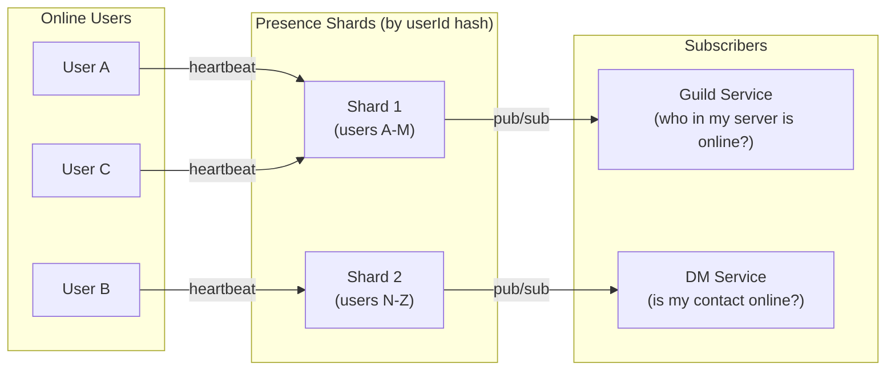

Presence state changes (online/offline) are published as events. Subscribers (guild service, DM service) maintain local caches updated by these events. No polling required.

---

## Offline Delivery and Message Queues

When a user is offline, messages must be held until they reconnect. Three strategies:

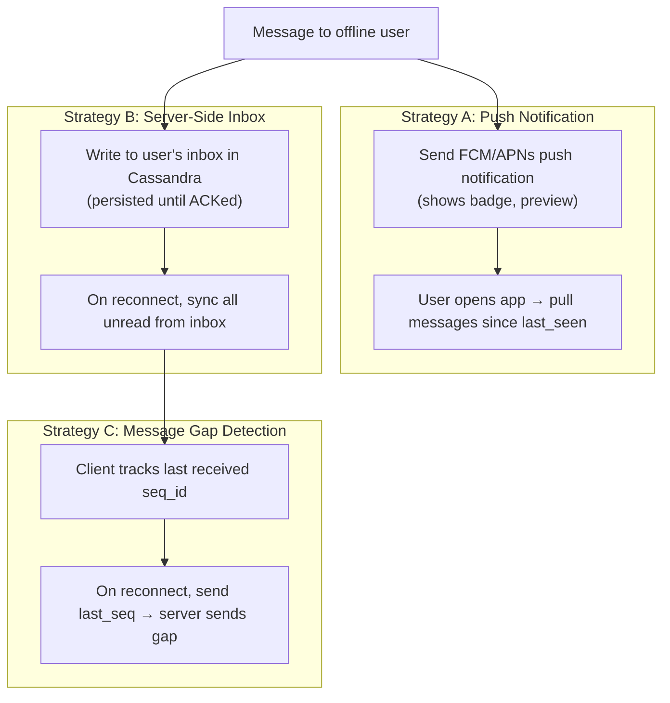

**Production systems use all three:**

1. **Push notification** — wakes the user's device instantly (FCM for Android, APNs for iOS).
2. **Server-side inbox** — persistent Cassandra record, never lost even if device is offline for weeks.
3. **Gap detection on reconnect** — client sends `last_received_id`, server returns all messages since then.

### Push Notification Architecture

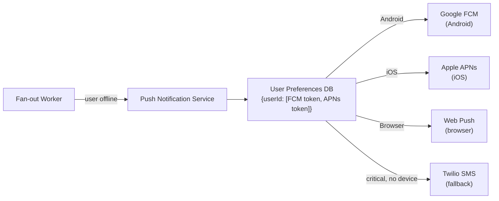

**Rate limiting:** never send more than 1 push per N seconds per user for the same conversation — bundle multiple messages into a single "X new messages" notification.

---

## Multi-Device Support

The same account on iPhone, MacBook, and iPad simultaneously. Each device has its own WebSocket connection.

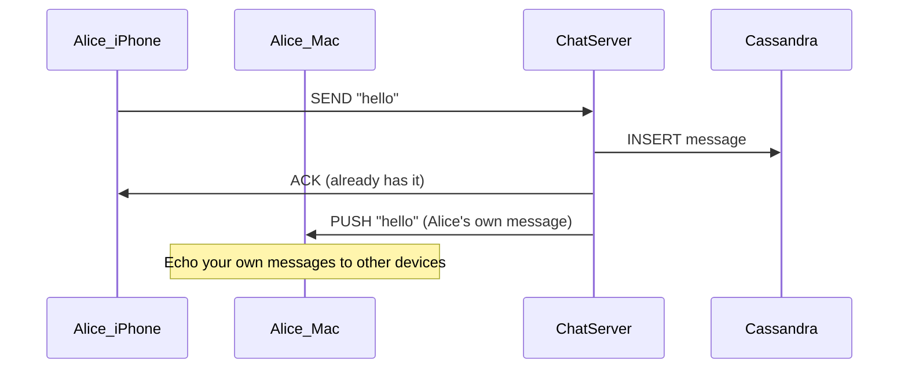

**Device registry:**
```sql
CREATE TABLE user_devices (
    user_id    UUID,
    device_id  UUID,
    platform   TEXT,   -- 'ios', 'android', 'web', 'desktop'
    push_token TEXT,
    last_seen  TIMESTAMP,
    PRIMARY KEY (user_id, device_id)
);
```

Fan-out to a user means fan-out to **all their active devices**, not just one.

**Message sync state** is per-device, not per-user. Device A may have read to seq=100 while Device B is at seq=80.

---

## History and Pagination

Chat history is read in reverse chronological order with cursor-based pagination.

### Why Not Offset Pagination?

`LIMIT 50 OFFSET 200` requires scanning 250 rows to skip 200. In Cassandra this is expensive and results are inconsistent if new messages arrive during pagination.

### Cursor-Based Pagination

```
GET /conversations/{id}/messages?before={message_id}&limit=50
```

- `before` is a Snowflake message ID — since Snowflakes are time-ordered, this is equivalent to "messages older than this one".
- Cassandra query: `WHERE conversation_id = ? AND message_id < ? ORDER BY message_id DESC LIMIT 50`
- Response includes the oldest message ID in the batch → use as next `before` cursor.

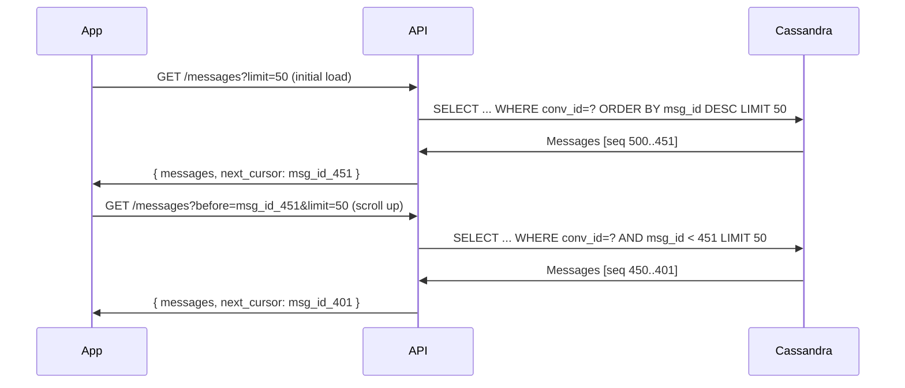

---

## Search

Full-text search across message history requires an inverted index — Cassandra cannot do this efficiently.

### Search Architecture

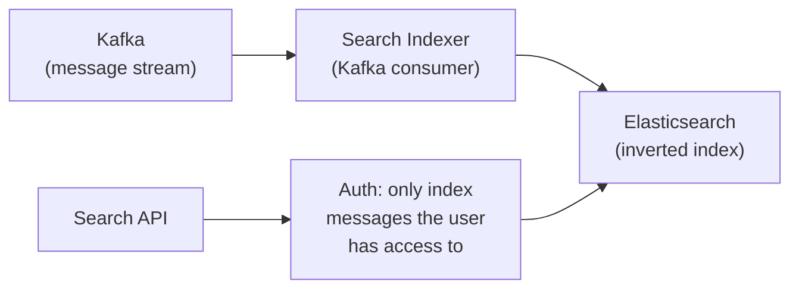

**Index document per message:**
```json
{
  "message_id": "874563218974",
  "conversation_id": "conv_abc",
  "sender_id": "user_xyz",
  "content": "let's schedule a meeting tomorrow at 3pm",
  "created_at": "2025-05-28T10:00:00Z",
  "conversation_members": ["user_xyz", "user_abc"]
}
```

**Search query** filters by `conversation_members` contains the requesting user — never return messages the user isn't a member of.

**Slack's approach:** search is scoped to your workspaces. Elasticsearch cluster per large workspace, shared cluster for smaller ones.

---

## Typing Indicators

Typing indicators are **ephemeral** — they should never be persisted or cause load spikes.

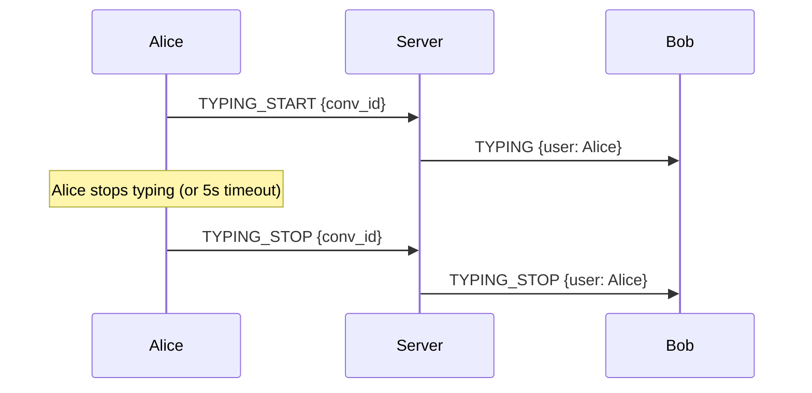

**Throttle rule:** client sends `TYPING_START` at most once every 3 seconds while typing. Server auto-expires typing state after 5 seconds even without `TYPING_STOP` (handles app crash, network drop).

Do **not** persist typing events. Route them server-to-server via Redis Pub/Sub to the WebSocket node holding Bob's connection — never hit the database.

---

## Media and File Handling

Images, videos, and files are never sent inline through the chat server.

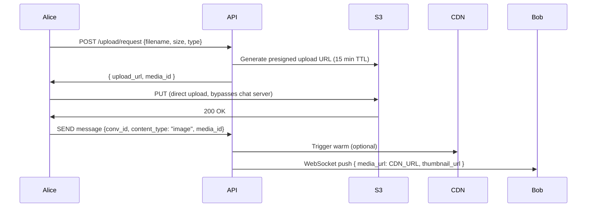

**Why presigned direct upload?**
- Chat server never handles large bytes — stays fast and light.
- S3 scales upload bandwidth independently.
- Presigned URLs expire quickly — no unauthorized uploads.

**CDN delivery:** all media is served through CloudFront / Cloudflare, not S3 directly. This gives edge caching and signed URL access control (prevent direct S3 hotlinking).

---

## Real-World Examples

### WhatsApp — Reliability at 100B Messages/Day

WhatsApp was originally built on **XMPP** (Extensible Messaging and Presence Protocol) with Erlang servers. Key design choices:

- **Store-and-forward:** messages are stored on WhatsApp servers only until delivered. Once delivered to all recipient devices, they are deleted from the server. This simplifies storage and supports their privacy model.
- **Signal Protocol (E2E encryption):** every message is encrypted on the sender's device with a key only the recipient holds. WhatsApp servers relay ciphertext they cannot read.
- **Offline queue per user:** if Bob is offline, the message waits on the server up to 30 days, then is dropped.
- **Multi-device sync (2021):** originally one primary device was authoritative. Multi-device required a new key distribution model where message keys are pre-distributed to each registered device.

**Lesson:** Simplicity (delete after delivery) can be a feature, not a limitation. It enabled WhatsApp to run at huge scale with a very small team.

---

### Slack — Organized Communication at Enterprise Scale

Slack's architecture centers on **workspaces** (shared namespaces) with **channels** and **threads**.

- **Channel service:** each channel is a logical entity with its own message log. The channel service owns ordering, membership, and history.
- **Flannel (edge caching):** Slack built a custom client-side caching layer to reduce API calls. The app caches recent messages locally; the server only sends diffs.
- **Threading:** replies to a message create a sub-conversation stored as a linked sequence. The parent message has a `reply_count` and `latest_reply` denormalized for display in channel view.
- **Search:** Slack indexes message content in Elasticsearch per workspace. Large workspaces (>100K messages) get dedicated shards.
- **Integrations / bots:** incoming webhooks and Slack apps write to channels via an API that goes through the same message pipeline as human messages — bots are just another sender.

**Lesson:** Workspaces as isolation boundaries make multi-tenancy simpler — each workspace can be routed to different server sets, databases, and search shards.

---

### Discord — Millions Concurrent, Gaming-Grade Reliability

Discord serves both text and voice/video. The text architecture is notable for its scale:

- **Cassandra for message storage:** switched from MongoDB → Cassandra in 2017, then explored ScyllaDB for lower tail latency.
- **Large guilds (servers):** some Discord servers have 500K+ members. Fan-out to all connected members on every message is impossible — Discord uses **lazy loading** for large guilds: messages are stored once, members pull when they open the channel.
- **Presence at scale:** Discord runs a custom presence system handling 10M+ concurrent users. Presence updates are event-driven (not polling) using their own distributed pub/sub.
- **Voice (WebRTC):** each voice channel is a separate WebRTC session routed through a regional Voice server cluster. Users connect P2P where latency allows, relay through servers otherwise.
- **Hot channel problem:** if a major streamer types in a Discord server with 1M members, even just routing the push notification to all online members requires careful rate limiting.

---

### Telegram — Speed and Openness

Telegram uses a custom binary protocol called **MTProto**, designed for speed on unreliable mobile networks.

- **Secret chats:** client-side E2E encryption with ephemeral keys, messages not stored on servers.
- **Cloud chats (default):** server-side storage with server-side encryption, enables cross-device sync and message access from any device.
- **Channels:** one-way broadcast to unlimited subscribers. Fundamentally different from groups — no fan-out to inboxes, subscribers pull.
- **MTProto:** uses a custom framing and encryption scheme optimized for mobile (UDP-like reliability over TCP connections with fast reconnection).

---

## Full System Architecture

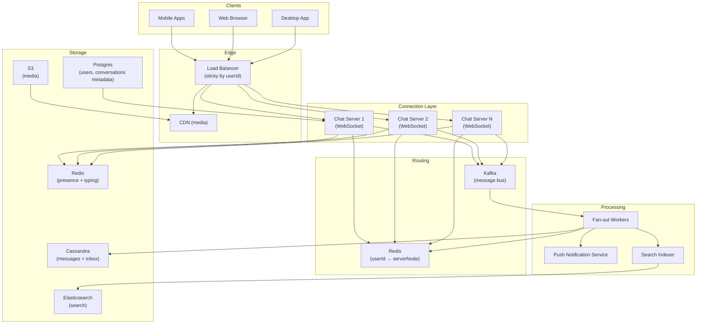

---

## Scaling Deep-Dive

### Connection Servers

Each chat server maintains tens of thousands of WebSocket connections. This is IO-bound (waiting for data), not CPU-bound. Node.js, Go, and Elixir/Erlang excel here — they handle 50K–100K concurrent WebSocket connections per node with low memory.

Java with virtual threads (JDK 21+) or reactive (WebFlux) also handles this well.

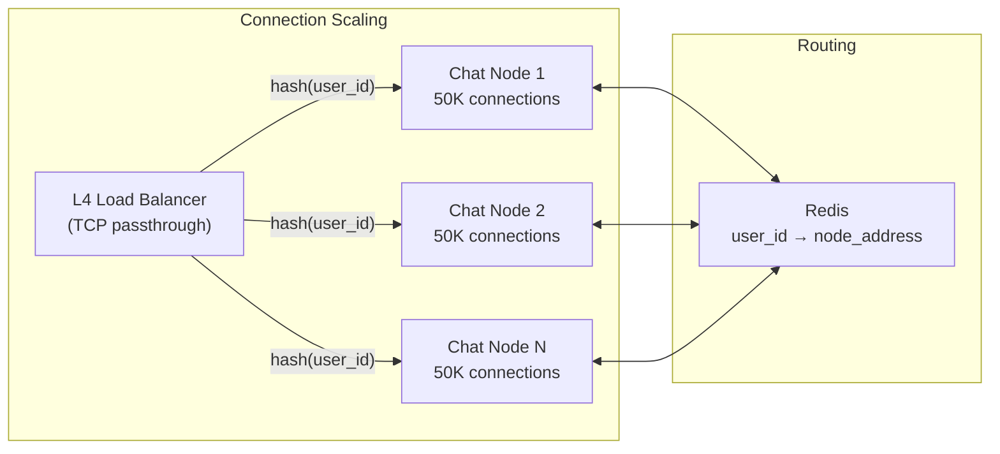

When chat server 2 receives a message for Bob (who is connected to server 1), it looks up server 1's address in Redis and forwards the push there via an internal HTTP or gRPC call.

### Kafka Partitioning

Messages are partitioned by `conversation_id`. All messages for the same conversation go to the same Kafka partition → in-order delivery guaranteed per conversation.

```
Topic: "chat-messages"
  Partition 0: conv_abc, conv_xyz, ...
  Partition 1: conv_def, conv_pqr, ...
  Partition N: ...
```

Fan-out workers are a Kafka consumer group. Each worker handles one or more partitions. Scaling fan-out = adding more consumers (up to the partition count).

---

## Key Design Decisions Summary

| Decision | Choice | Reason |
|---|---|---|
| Transport | WebSocket | Full-duplex, low latency, persistent |
| Message IDs | Snowflake | Time-ordered, globally unique, no coordination |
| Message storage | Cassandra | Append-only, time-range queries, TTL, horizontal scale |
| Fan-out | Kafka + workers | Decouples write from delivery, replay on crash |
| Presence | Redis TTL + heartbeat | Sub-second updates, auto-expiry, no DB writes |
| Search | Elasticsearch | Inverted index for full-text, Cassandra can't do this |
| Media | S3 + CDN + presigned URLs | Server never touches bytes, CDN for low latency |
| Offline delivery | Server inbox + push notifications | Never lose messages, instant wake-up |
| Pagination | Cursor-based (Snowflake ID) | Consistent, efficient on Cassandra |

---

## Interview Cheat Sheet

| Question | Answer |
|---|---|
| Why WebSocket over HTTP? | Server needs to push instantly; HTTP is request-only |
| How do you order messages? | Server assigns Snowflake IDs or per-conversation sequence numbers — never trust client timestamps |
| How do you handle offline users? | Persist to inbox (Cassandra), send push notification (FCM/APNs), client gap-syncs on reconnect |
| How do you fan-out to 10K members? | Kafka fan-out workers; hybrid push/pull based on group size |
| How do you implement presence? | Redis SETEX with 60s TTL, heartbeat every 30s, last_seen on expiry |
| Why Cassandra for messages? | Append-only access, time-range queries, TTL, no joins needed |
| How do you route a push across chat servers? | Redis `{userId → serverNode}` registry; cross-server internal RPC |
| What about search? | Async index into Elasticsearch via Kafka consumer |
| How do you prevent thundering herd on reconnect? | Jitter on reconnect delay, rate-limit sync requests, staggered reconnects |
| How does multi-device work? | Fan-out to all devices of a user; per-device read cursors |

---

## Further Reading

### Must-Watch Videos

- **[Design a Chat System — ByteByteGo](https://www.youtube.com/watch?v=vvhC64hQZMk)** — Clear walkthrough of WhatsApp/Slack-style architecture.
- **[How Discord Stores Billions of Messages](https://www.youtube.com/watch?v=qMv5R7WJLiw)** — Engineering deep-dive on Cassandra and ScyllaDB at Discord's scale.
- **[Scaling Slack — Bing Wei (QCon)](https://www.youtube.com/watch?v=o4f5G9q_9O4)** — How Slack's architecture evolved from monolith to service-per-channel.
- **[WhatsApp Architecture — InfoQ](https://www.youtube.com/watch?v=c12cYAUTXXs)** — Erlang, XMPP, and how 2 engineers ran 450M users.

### Articles

- **[Discord: How Discord Stores Billions of Messages](https://discord.com/blog/how-discord-stores-billions-of-messages)** — Detailed Cassandra schema and partition design decisions.
- **[Discord: Scaling Presence to 10 Million Concurrent](https://discord.com/blog/how-discord-maintains-performance-while-adding-features)** — Custom presence event system design.
- **[Slack Engineering: Scaling Slack](https://slack.engineering/scaling-slack-the-good-the-unexpected-and-the-oh-boy/)** — Growing pains and solutions at enterprise scale.
- **[Flannel: An Application-Level Edge Cache for Facebook](https://engineering.fb.com/2011/09/19/web/building-facebook-messenger/)** — Client-side caching for chat (Facebook Messenger origin).
- **[WhatsApp's Architecture and Lessons Learned](https://highscalability.com/blog/2014/2/26/the-whatsapp-architecture-facebook-bought-for-19-billion.html)** — High Scalability breakdown.
- **[Building Real-Time Chat with Kafka](https://www.confluent.io/blog/real-time-chat-kafka/)** — Confluent guide to Kafka-backed chat fan-out.
- **[WebSocket at Scale — Ably Engineering](https://ably.com/topic/websockets)** — Connection management, reconnection strategies, and scaling patterns.

### Papers

- **[End-to-End Encryption in the Signal Protocol](https://signal.org/docs/specifications/doubleratchet/)** — Double Ratchet algorithm spec used in WhatsApp, Signal, and iMessage.
- **[XMPP Core RFC 6120](https://www.rfc-editor.org/rfc/rfc6120)** — The protocol that underpins WhatsApp's original transport layer.
