# Content History and Versioning: System Design

> **Problem statement:** Design a system that not only stores current content but preserves its full history — every past state must be retrievable, diffable, and potentially restorable. The content may be text documents, diagrams, or binary assets like images.

---

## Overview

Nearly every serious content system eventually needs versioning. The questions are always the same:

- *What exactly is a "version"?*
- *Do I store complete copies or just what changed?*
- *How do I compute the difference between any two versions?*
- *How do I handle binary data that can't be text-diffed?*
- *How do I keep storage costs reasonable as history grows?*

The right answers differ dramatically depending on how large the content is, how often it changes, and how often users browse old versions.

---

## Core Concepts

### Snapshot vs. Delta

These are the two fundamental storage primitives. Most production systems use both.

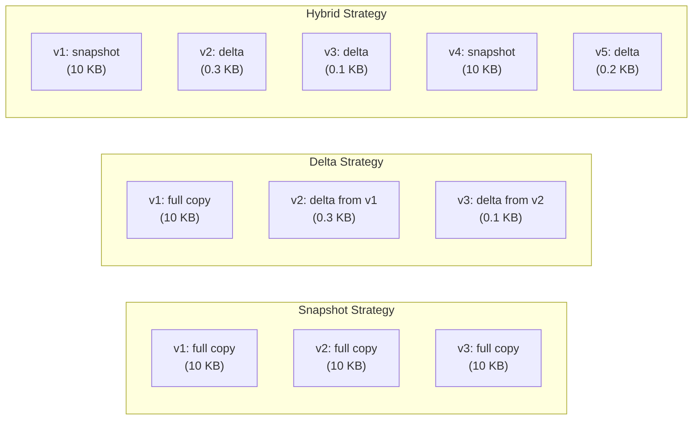

| Strategy | Storage Cost | Read Latency | Write Latency | Best For |
|---|---|---|---|---|
| Snapshot | O(n × size) | O(1) | O(size) | Small content, frequent reads of old versions |
| Delta chain | O(n × change) | O(chain length) | O(change) | Large content, mostly linear history |
| Hybrid (snapshots + deltas) | O(log n × size) | O(log n) | O(change) | Most production systems |

### Content-Addressable Storage

Instead of naming objects by path + version number, name them by the **hash of their content**. The same content always has the same address. This gives you deduplication for free.

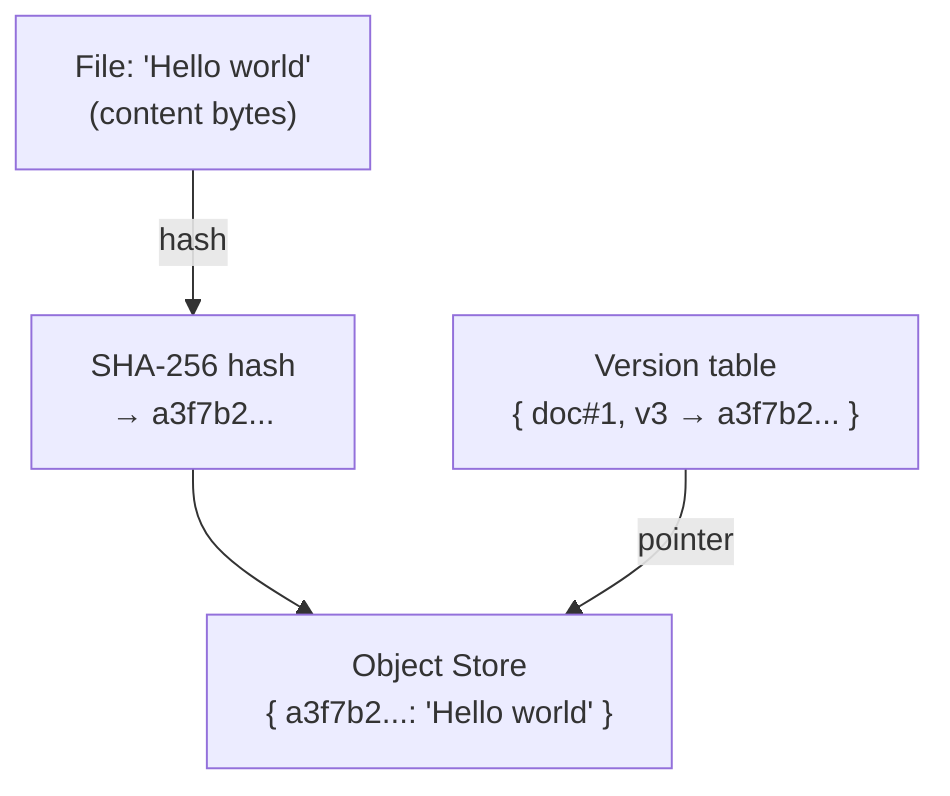

**Key properties:**
- Identical content stored only once regardless of how many versions reference it.
- Hashes are immutable — you can never corrupt a stored version by accident.
- Verification is built-in: re-hash the content, compare to the stored address.

This is the foundation of **Git**, **IPFS**, and most modern blob stores.

---

### Persistent Data Structures

A *persistent* data structure preserves all previous versions of itself when modified. Structural sharing makes this efficient — unchanged subtrees are reused, not copied.

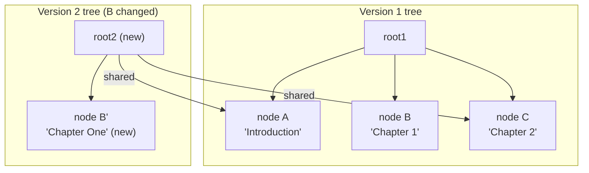

Only the changed path from root to the modified node is copied. All unchanged subtrees are shared. This is called **path copying** and is used in functional languages, immutable databases, and Git trees.

---

### Merkle Trees

A Merkle tree is a hash tree where every internal node stores the hash of its children. This lets you verify *which parts* of a large structure changed with O(log n) comparisons.

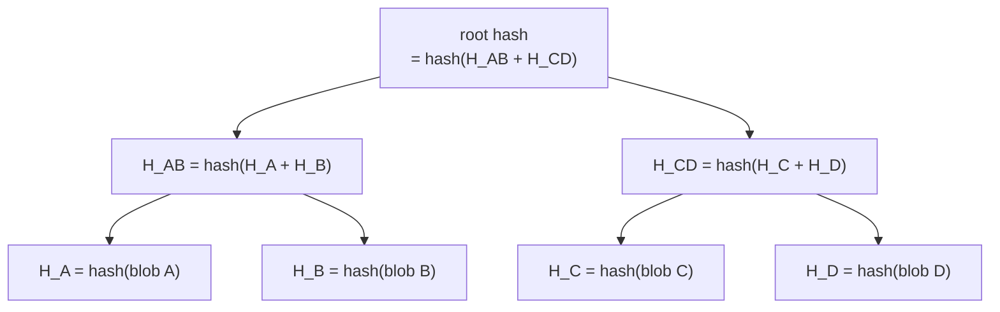

If only blob B changed, only H_B, H_AB, and ROOT change. You can detect exactly what changed between two versions by comparing root hashes first, then recursing only into mismatched branches.

**Used by:** Git (trees), IPFS, Cassandra (anti-entropy), blockchain.

---

### Temporal Databases

SQL:2011 introduced **system-versioned temporal tables** — the database itself tracks row history with `VALID_FROM` and `VALID_TO` timestamps.

```sql
CREATE TABLE document (
    id         UUID,
    title      TEXT,
    body       TEXT,
    valid_from TIMESTAMP GENERATED ALWAYS AS ROW START,
    valid_to   TIMESTAMP GENERATED ALWAYS AS ROW END,
    PERIOD FOR SYSTEM_TIME (valid_from, valid_to)
) WITH SYSTEM VERSIONING;

-- Query any past state:
SELECT * FROM document FOR SYSTEM_TIME AS OF '2025-01-01 12:00:00' WHERE id = ?;
```

Supported by: MariaDB, SQL Server, Oracle, DB2. PostgreSQL has no native syntax but achieves the same via triggers and a `_history` table.

---

## How Real Systems Do It

### Git — Content-Addressable DAG

Git is the canonical example of a well-designed versioning system. Its design decisions are worth understanding in depth.

**Four object types:**

| Object | Contains | Hash Input |
|---|---|---|
| **blob** | raw file bytes | file content |
| **tree** | list of (mode, name, blob/tree hash) | directory listing |
| **commit** | tree hash + parent hash(es) + metadata | above |
| **tag** | commit hash + annotation | above |

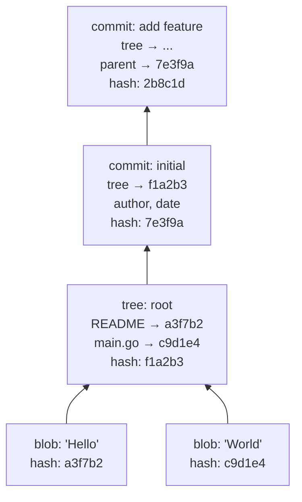

**Branching is free:** A branch is just a named pointer (a file containing a commit hash). Creating a branch copies 41 bytes. The DAG structure allows a commit to have multiple parents (merge commits).

**Pack files:** Git starts by writing loose objects (one file per hash). Periodically it packs them into a `.pack` file with binary delta compression between similar objects. This is why a repo with 10,000 commits doesn't have 10,000 full copies of every file — Git finds similar blobs and stores only deltas, but retrieval is always by the content hash (deltas are internal to the pack).

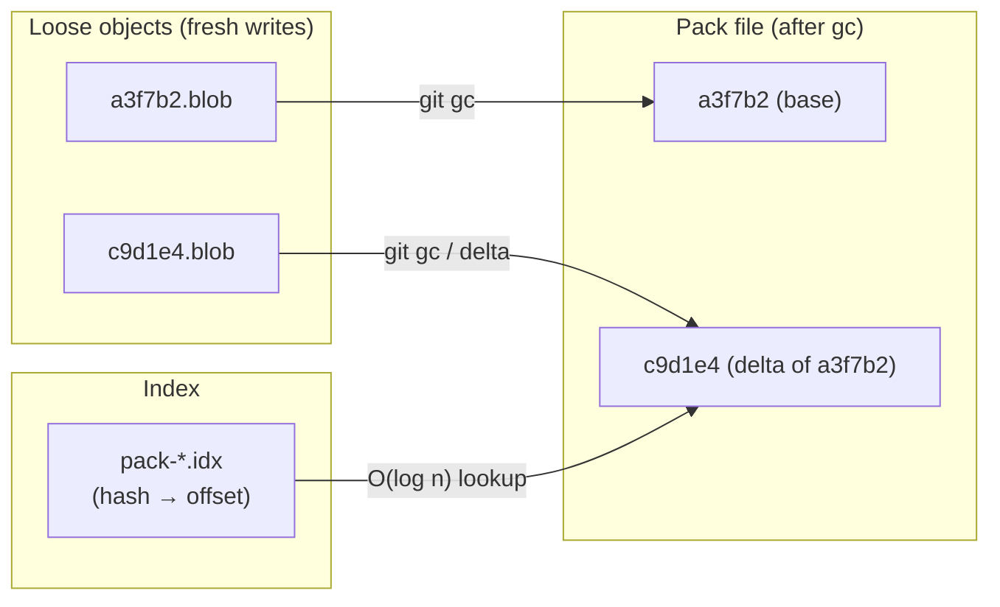

---

### Microsoft Word — Track Changes

Word's `.docx` format is a ZIP archive containing XML files (OOXML standard). Tracked changes are embedded inline in the document XML.

```xml
<w:p>
  <w:ins w:id="1" w:author="Alice" w:date="2025-05-01T10:00:00Z">
    <w:r><w:t>new text</w:t></w:r>
  </w:ins>
  <w:del w:id="2" w:author="Bob" w:date="2025-05-01T10:05:00Z">
    <w:r><w:delText>old text</w:delText></w:r>
  </w:del>
</w:p>
```

**How it works:**
- Every `<w:ins>` and `<w:del>` element is a pending change with author and timestamp.
- The document can be rendered in three modes: *Show Markup*, *Final*, *Original*.
- Accepting a change strips the markup wrapper; rejecting reverses it.
- Formatting changes use `<w:rPrChange>` which stores the previous formatting inline.

**Limitation:** Track Changes works well for flat text but becomes messy for table restructuring, style changes, and complex layouts. It is also a *collaborative annotation layer*, not a true version history — there is no concept of "go back to the document as it was on Tuesday."

---

### Confluence — Page Version History

Confluence stores full page content per version. Each save creates a new row in the `CONTENT` and `BODYCONTENT` tables.

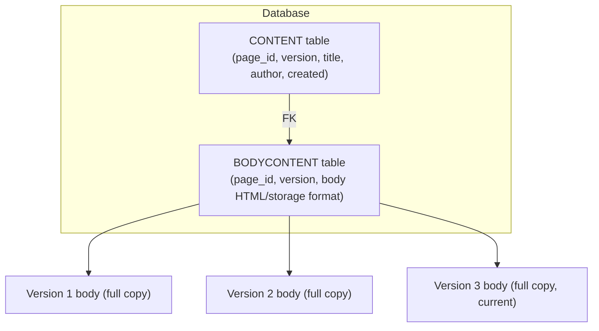

**Design decisions (and tradeoffs):**

- Full snapshot per version — reads are O(1), storage grows linearly with edits.
- Diff is computed **on the fly** at display time using a text diff library (Myers diff algorithm) on the HTML/storage representation.
- No git-style DAG — Confluence history is strictly linear per page.
- Spaces accumulate massive history over years; administrators must archive or purge.

**Problem:** The "diff" Confluence shows is a textual diff of HTML markup, not a semantic diff. Moving a paragraph may appear as a huge deletion + insertion rather than a move operation.

---

### Wikipedia / MediaWiki

MediaWiki is architecturally similar to Confluence but openly documented.

- Each revision stores the **full wikitext** in the `revision` + `text` tables.
- The `revision` table has `rev_parent_id` — a linked list of revisions.
- Diff display uses the **wikidiff2** extension (C++ Myers diff for performance).
- Storage backend is pluggable — old revisions can be offloaded to ExternalStore (compressed blob files or separate DB).

**Scale:** English Wikipedia has ~1.2 billion revisions for ~6 million articles. Storing full wikitext per revision requires aggressive compression. The `text` table uses `gzip` on each stored blob.

---

### Google Docs — Version History

Google Docs exposes "Named Versions" and "See version history" to users. Internally:

- Each user operation is logged as an OT operation (as described in the collaborative editing article).
- Periodically, a **snapshot** of the document is materialized and stored.
- The version history UI shows a timeline of snapshots, not individual keystrokes.
- Users can restore to any snapshot; this creates a new edit that overwrites current content (it is not a true rollback in the OT log sense).

**Lesson:** The internal operation log (audit) and the user-facing version history are often two different abstractions. Users want "states at significant points in time," not a log of every keystroke.

---

### Figma — Version History

Figma's version history is notable because the underlying data is a CRDT, not text.

- Figma maintains a continuous log of CRDT operations.
- Versions are materialized snapshots of the CRDT document state at specific points.
- Named versions are stored explicitly; auto-saved versions are compacted (older ones pruned over time).
- Restoring a version applies the historical snapshot as a new CRDT state — preserving the history that comes after.

**Semantic diff for diagrams:** Figma can show what changed between versions at the *shape* level ("Alice added a rectangle", "Bob changed fill color") because the CRDT tracks individual shape objects with stable IDs. This is far more useful than a pixel diff.

---

## Handling Binary Data

Text diff algorithms (Myers, Patience, Histogram) produce human-readable, compact deltas for text. Binary data is harder.

### Why Binary Diff Is Hard

- Changing one byte in a JPEG can alter thousands of subsequent bytes due to entropy coding.
- Most binary formats have no concept of "lines" or "tokens" to align on.
- A resized image is completely different in binary representation even if visually similar.

### Strategy 1: Content-Addressable Full Copies (Simplest)

Store each version as a separate blob, identified by hash. Deduplication handles the case where the same binary appears in multiple versions (unchanged attachment).

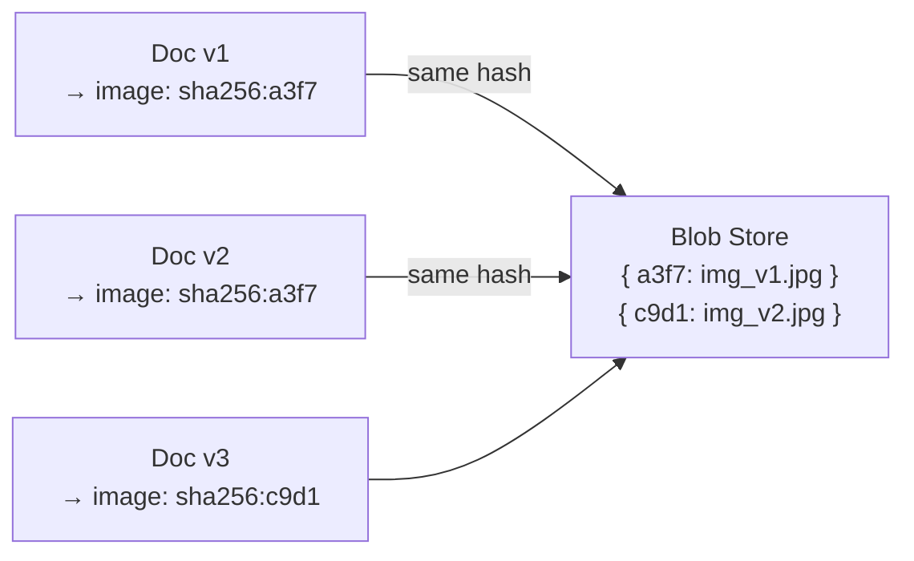

If the image didn't change between v1 and v2, both versions point to the same blob. Storage is only charged once.

### Strategy 2: Git LFS (Large File Storage)

Git LFS replaces the binary file in the Git repository with a small **pointer file** (text). The actual binary is stored on an LFS server (S3, Azure Blob, etc.).

```
version https://git-lfs.github.com/spec/v1
oid sha256:a3f7b2c9d1e4f5a6b7c8d9e0f1a2b3c4...
size 4823941
```

The Git history remains fast and lightweight. Binary versions accumulate in the LFS backend. LFS servers can implement delta compression between similar binaries as a storage optimization.

### Strategy 3: S3 Versioning

Amazon S3 supports object versioning natively. Every `PUT` to a versioned bucket creates a new version; no object is ever overwritten or deleted by default.

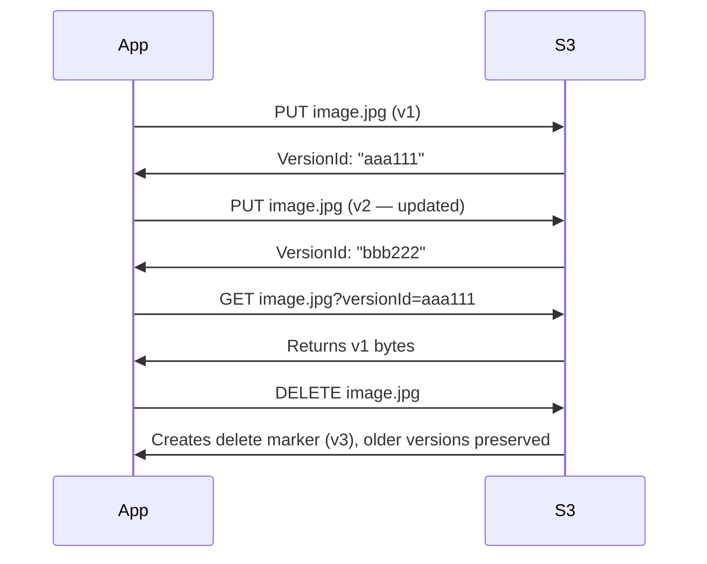

**Cost:** You pay for every stored version. Lifecycle policies can automatically transition old versions to cheaper storage tiers (S3-IA, Glacier) or delete them after N days.

### Strategy 4: Binary Delta Algorithms

For specific binary formats, delta compression is viable:

| Algorithm | Good For | Notes |
|---|---|---|
| **bsdiff** | Executables, compressed files | Treats binary as integers, not bytes |
| **xdelta / libvcdiff** | Any binary with partial similarity | Used in Chrome update mechanism |
| **rsync rolling hash** | File sync over network | Block-level similarity detection |
| **zstd with dictionaries** | Short documents with shared structure | Train dict on typical content |
| **Pixel-level image diff** | PNG, uncompressed images | Store changed regions only |

**Caution:** Computing a delta between two 50 MB Photoshop files takes seconds of CPU. Only worthwhile for large, frequently-updated files where you have many versions.

### Strategy 5: Format-Aware Semantic Storage

For formats you control (diagrams, rich text, presentations), store the **data model**, not the rendered binary.

A diagram stored as JSON (nodes, edges, styles) can be diffed as JSON. An SVG can be diffed as XML. Reconstruct the visual representation on demand. This is how Figma, draw.io, and Miro work internally.

---

## Diff Algorithms Worth Knowing

| Algorithm | Complexity | Best For |
|---|---|---|
| **Myers (1986)** | O(ND) | Standard text diff, used in Git, Wikipedia |
| **Patience diff** | O(N log N) | Code diffs with long common prefixes |
| **Histogram diff** | O(N log N) | Git's default for `--histogram` |
| **Semantic diff** | Domain-specific | JSON, AST, diagram node diff |
| **Three-way merge** | O(N) | Git merge, OT base for collaborative edit |

**Three-way merge** is the foundation of git merge, OT conflict resolution, and most document version reconciliation:

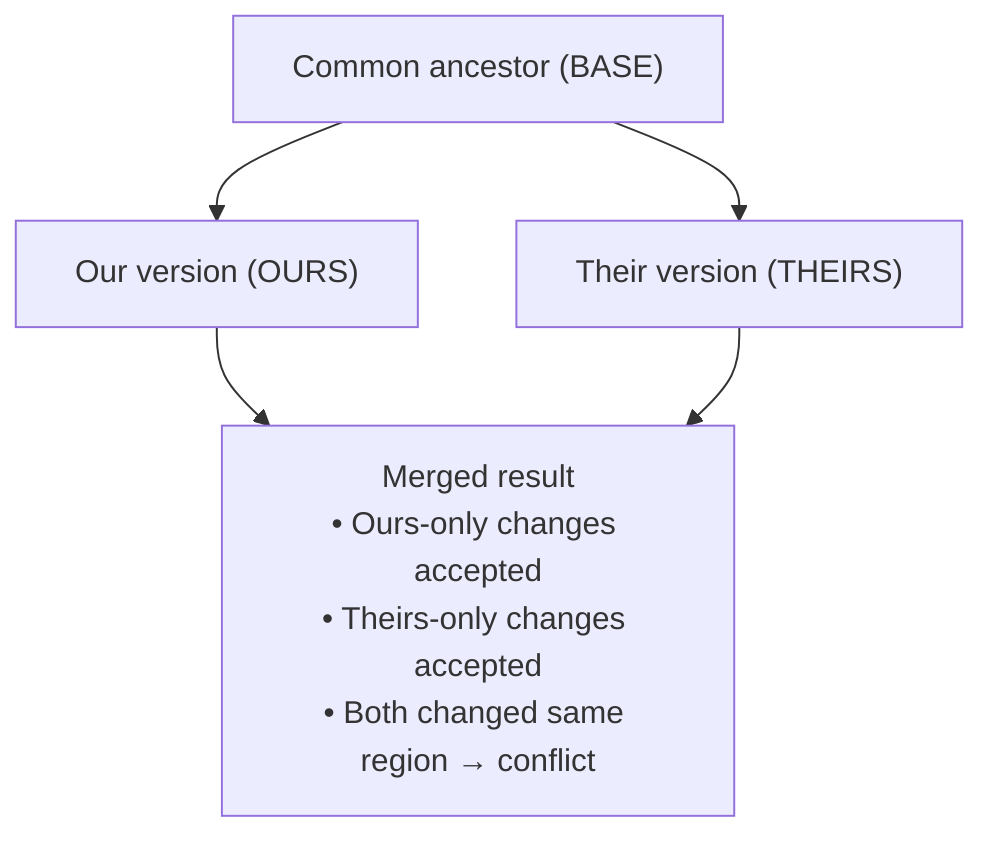

---

## System Design: Confluence-like Editor with Full History

### Requirements

- Users create and edit rich-text articles.
- Every save creates a new version; no data is ever permanently deleted.
- Users can view any historical version and diff any two versions.
- Users can restore (roll back) to any past version.
- Multiple users may edit simultaneously (covered in the collaborative editing article — assume OT or CRDT underneath).
- Attachments (images, PDFs) are versioned too.

### Data Model

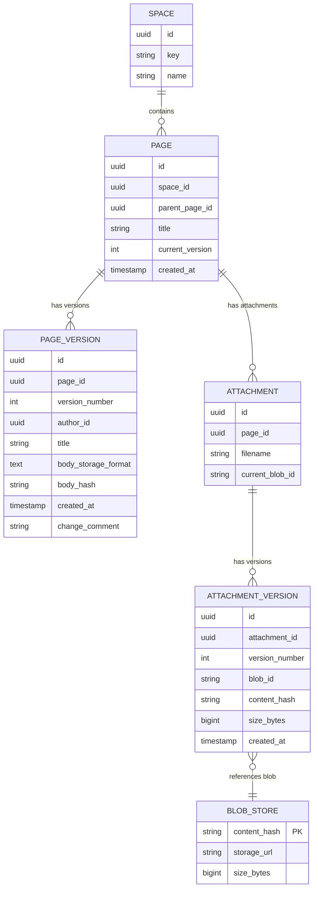

**Key design decisions:**

1. `PAGE_VERSION` stores **full body content** per version (snapshot strategy). For typical wiki articles (< 500 KB), storage is cheap and retrieval is O(1). No delta chain reconstruction needed.
2. `body_hash` is the SHA-256 of the body content — used to detect duplicate saves (if user hits Save without changing anything, don't create a new version) and to deduplicate in blob storage.
3. Attachments use **content-addressable blob storage** — two page versions referencing the same unchanged image share the same blob.
4. `BLOB_STORE` is the single source of truth for binary content; page versions reference it by hash.

### Architecture

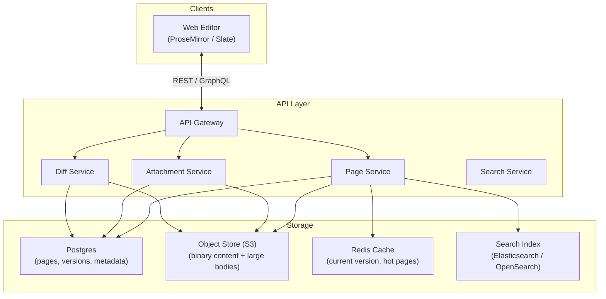

### Save Flow

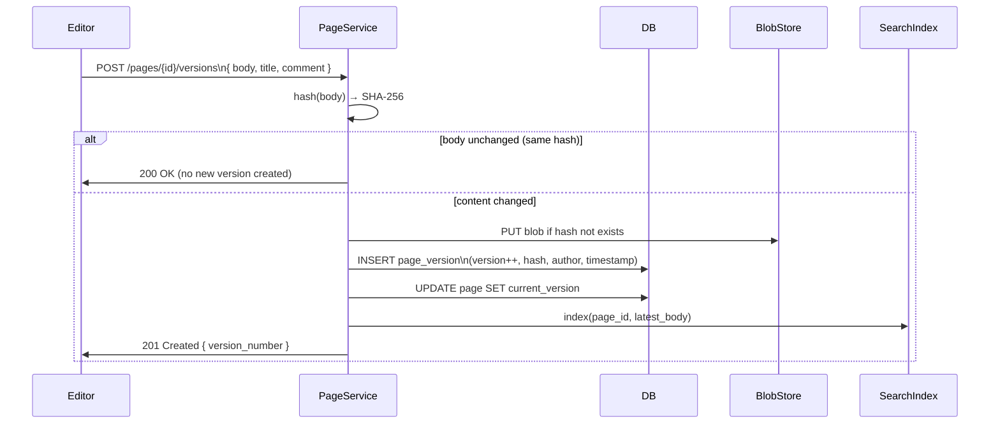

### Diff and Restore Flow

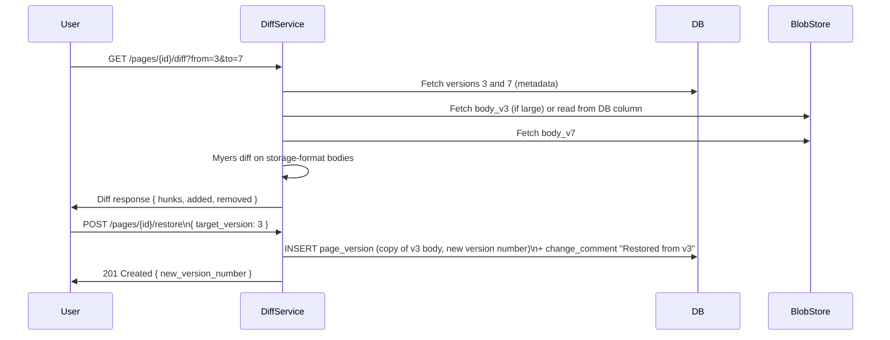

**Why restore creates a new version instead of rolling back the pointer:** This preserves the full history. You can see that a restore happened, who did it, and when. If the restore was a mistake, you can restore again from the version just before the restore.

### Version Pruning / Archival

As pages accumulate years of history, storage grows. A tiered retention policy:

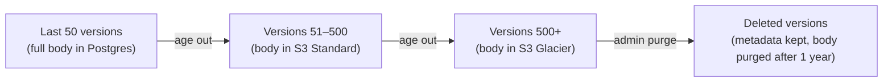

---

## System Design: Versioned Diagram Tool

*Scenario: A collaborative diagramming tool (like draw.io / Lucidchart) with branching version history.*

### Why Diagrams Are Different from Text

- The diagram state is a **graph** (nodes + edges + properties), not a sequence of characters.
- A textual diff of the JSON representation is hard to read ("node at array index 4 changed").
- What users want is a **semantic diff**: "Box 'Login Service' moved 50px right", "Arrow deleted", "Label changed from X to Y".
- Versions may be **branched** (like Git) — team A works on version A, team B on version B, they merge.

### Data Model

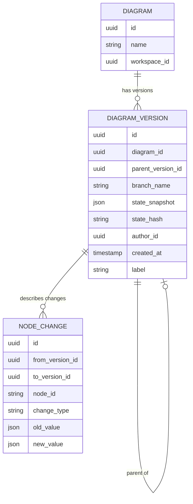

`DIAGRAM_VERSION.state_snapshot` stores the full diagram JSON (nodes, edges, styles). `NODE_CHANGE` is a materialized semantic diff, pre-computed at save time for fast diff display.

### Semantic Diff Algorithm

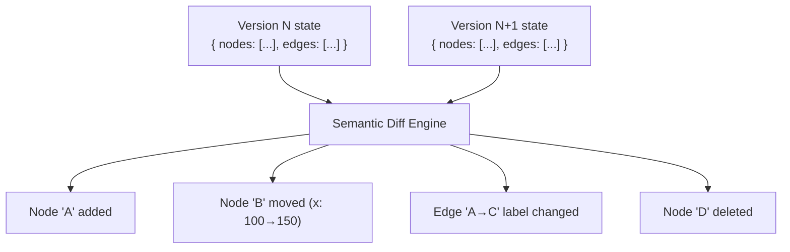

**Algorithm (simplified):**
1. Build two maps: `{node_id → node}` for old and new state.
2. **Deleted nodes** = IDs in old but not in new.
3. **Added nodes** = IDs in new but not in old.
4. **Changed nodes** = IDs in both with different property values (compare field by field).
5. Repeat for edges.
6. **Moved node** = deleted node whose shape+label appears near an added node? Heuristic match (costly, skip for large diagrams).

### Branching History

For teams working on architectural variants in parallel:

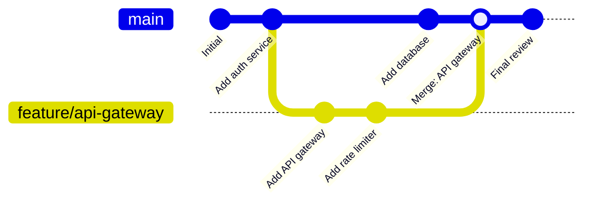

Merging two diagram versions uses the **three-way merge** algorithm on the node/edge maps:
- Nodes only in `ours` → keep
- Nodes only in `theirs` → keep
- Nodes in both, same value → keep
- Nodes in both, different values → **conflict** (ask user to resolve)
- Nodes deleted in `ours` but modified in `theirs` → **conflict**

---

## Comparison of Versioning Approaches

| System | Storage Model | Diff Type | Binary Support | Branching | Offline |
|---|---|---|---|---|---|
| **Git** | Content-addressable + pack deltas | Text (line-level) | Via LFS | Full DAG | ✅ |
| **Confluence** | Full snapshot per version | HTML text diff | Separate attachment versions | ❌ (linear) | ❌ |
| **MediaWiki** | Full wikitext per revision | Myers text diff | Separate upload log | ❌ | ❌ |
| **Google Docs** | OT log + periodic snapshots | Character-level | Inline in doc format | ❌ | Limited |
| **Figma** | CRDT log + snapshots | Semantic (shape-level) | Asset refs to CDN | ❌ | ✅ |
| **S3 Versioning** | Full object copy per version | None (binary) | ✅ Native | ❌ | ❌ |
| **Word Track Changes** | Inline revision markup | Character-level inline | N/A | ❌ | ✅ |

---

## Key Takeaways

1. **Snapshot is fine for small content.** Don't over-engineer delta compression for documents under 1 MB — storage is cheap, query simplicity is valuable.
2. **Content-addressable storage gives you deduplication for free.** Hash the content, use the hash as the key. Identical blobs across versions are stored once.
3. **Separate the internal log from user-facing versions.** Users want "document state at 3pm Tuesday", not "keystroke #94,821".
4. **Semantic diff beats text diff for structured data.** "Node added" is more useful than "+  \"id\": \"n42\", \"x\": 100".
5. **Restore should create a new version, not truncate history.** Preserve the full audit trail.
6. **Binary data needs a different strategy than text.** Content-addressable + S3 versioning is the pragmatic default. Delta compression only pays off for large files with many similar versions.
7. **Temporal tables solve the "time travel" query** elegantly at the database level if your domain fits relational data.
8. **Git's DAG is a general pattern.** Any system that needs branching, merging, and non-linear history can borrow its commit/tree/blob structure.

---

## Further Reading

### Videos

- **[Git Internals — Scott Chacon (2008, still relevant)](https://www.youtube.com/watch?v=lG90LZotrpo)** — Deep walkthrough of Git's object model: blobs, trees, commits, pack files.
- **[How Git Works — Paolo Perrotta (Railsconf)](https://www.youtube.com/watch?v=1ffBJ4sVUb4)** — Best visual explanation of Git's graph model for developers.
- **[Immutable Data and Persistent Data Structures — Rich Hickey](https://www.youtube.com/watch?v=wASCH_gPnDw)** — Why structural sharing and immutability matter at scale.
- **[How Figma's Multiplayer Technology Works](https://www.youtube.com/watch?v=LA3VgWHOhL8)** — Includes how Figma stores and compacts version history.

### Articles

- **[Git Internals — Pro Git Book (Chapters 10.2–10.4)](https://git-scm.com/book/en/v2/Git-Internals-Git-Objects)** — The definitive written reference for Git's object model, pack files, and delta compression.
- **[Designing a Version History System — Notion Engineering Blog](https://www.notion.so/blog/how-we-store-data-at-notion)** — How Notion handles page history and storage tiering.
- **[S3 Versioning Deep Dive — AWS Documentation](https://docs.aws.amazon.com/AmazonS3/latest/userguide/Versioning.html)** — Complete reference for S3 object versioning and lifecycle policies.
- **[Temporal Tables in MariaDB](https://mariadb.com/kb/en/system-versioned-tables/)** — Practical guide to SQL system-versioned tables.
- **[How Confluence Stores Page Content — Atlassian Developer Docs](https://developer.atlassian.com/server/confluence/confluence-storage-format/)** — Storage format specification for Confluence body content.
- **[bsdiff and bspatch — Colin Percival](https://www.daemonology.net/bsdiff/)** — The standard algorithm for binary delta patching.
- **[Myers Diff Algorithm — James Coglan](https://blog.jcoglan.com/2017/02/12/the-myers-diff-algorithm-part-1/)** — Clear explanation of the algorithm behind `diff`, `git diff`, and most text diff tools.
- **[Content-Addressable Storage — Wikipedia](https://en.wikipedia.org/wiki/Content-addressable_storage)** — Overview with links to CAS implementations.
- **[Merkle Trees — Brilliant.org](https://brilliant.org/wiki/merkle-tree/)** — Visual explanation of Merkle trees and their verification properties.
