# Real-Time Collaborative Editor: System Design

> **Interview question:** Design a real-time collaborative editor (like Google Docs).
> Focus: Conflict resolution (OT vs. CRDT), cursor presence, offline support.

---

## Overview

Real-time collaboration means multiple users edit the **same shared state simultaneously** and see each other's changes with low latency. The shared state could be a text document, a canvas, a spreadsheet, a game world, or a video conference.

The challenge is deceptively simple to state: *if two people change the same thing at the same time, whose change wins — and how do you make sure nobody loses work?*

The answer depends heavily on the data model. Text has very different constraints than a pixel canvas, which differs from a physics simulation.

---

## The Core Problem: Concurrent Edits

Imagine two users, Alice and Bob, both reading the same document state `"Hello"`:

- Alice inserts `"!"` at position 5 → `"Hello!"`
- Bob deletes character at position 5 → `"Hell"`

If you naively apply both operations in sequence, the result is wrong. The *positions* Alice and Bob used were relative to the **same original state**, but the operations transform the state differently.

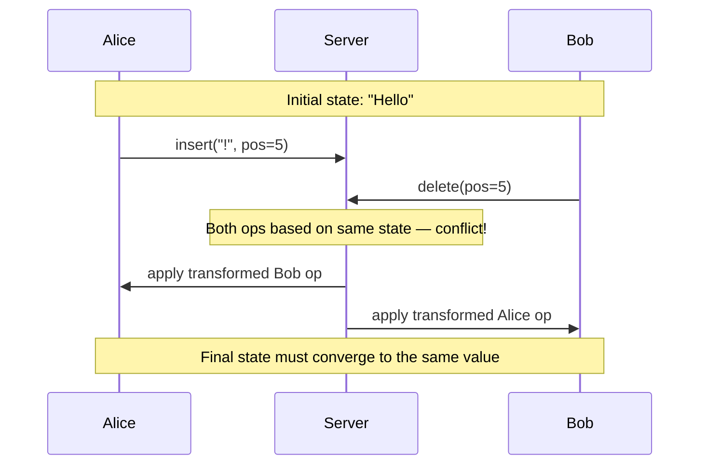

The two fundamental properties any solution must guarantee:

| Property | Meaning |
|---|---|
| **Convergence** | All replicas eventually reach the same state |
| **Intent Preservation** | Each user's edit does what they intended |

---

## Conflict Resolution Strategies

### 1. Last-Write-Wins (LWW)

The simplest approach: every write carries a timestamp. The latest timestamp wins.

**How it works:** Each operation is tagged with a wall-clock or logical timestamp. Conflicts are resolved by discarding the operation with the older timestamp.

**Used by:** Redis, Cassandra (optional), simple presence systems.

**Pros:** Trivial to implement, no coordination needed.  
**Cons:** Silently discards work. Alice's edit disappears with no warning. Unacceptable for text editing, acceptable for cursor positions.

---

### 2. Operational Transformation (OT)

OT was invented in 1989 and powers **Google Docs**.

**Core idea:** Before applying a remote operation, *transform* it against all operations that happened concurrently, so its intent is preserved in the updated context.

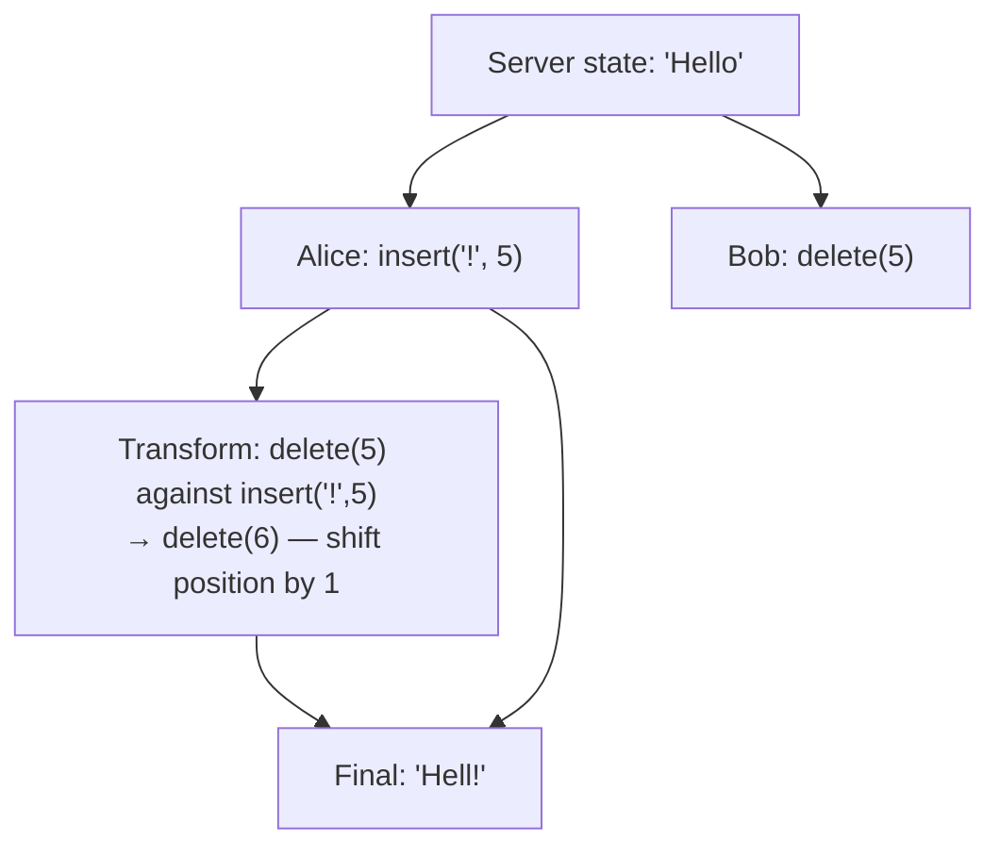

**The transform function** must handle every pair of operation types:
- insert vs insert
- insert vs delete
- delete vs delete
- ... and so on for rich text (formatting, annotations, etc.)

**OT in a centralized system (Jupiter/Google Docs model):**

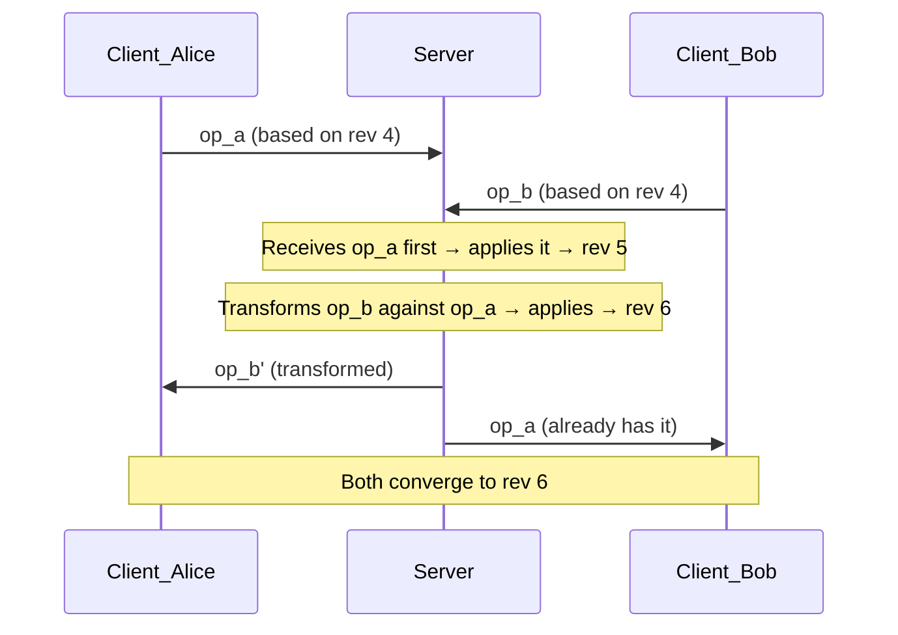

**Pros:** Well-understood, battle-tested at Google scale, works perfectly with a central server.  
**Cons:** The transform functions are notoriously hard to get right for complex types (rich text, tables). Peer-to-peer OT requires a *total order* protocol, which is very complex.

---

### 3. Conflict-Free Replicated Data Types (CRDT)

CRDTs are data structures with a mathematically guaranteed merge operation. You don't need a central server to resolve conflicts — any two replicas can be merged in any order and produce the same result.

**Two families:**

| Type | How it works | Example |
|---|---|---|
| **State-based (CvRDT)** | Replicas exchange their full state; merge = join (least upper bound) | G-Counter, OR-Set |
| **Op-based (CmRDT)** | Replicas exchange operations; ops are commutative | RGA, Logoot, Yjs |

**Text CRDT example (RGA — Replicated Growable Array):**

Every character gets a globally unique ID (site ID + logical clock). Characters are ordered by their IDs, not by position. Insertions are always relative to a *specific character's ID*, not an integer index.

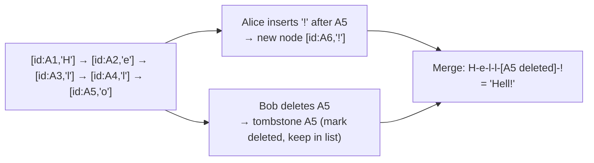

Notice Bob's delete uses the stable ID `A5`, not a shifting integer position. No transform needed.

**Used by:** Figma, Linear, Notion (partially), Automerge, Yjs.

**Pros:** Works fully offline and peer-to-peer. No server required for convergence. Naturally handles network partitions.  
**Cons:** Higher memory overhead (tombstones accumulate). More complex to implement correctly for rich text with formatting spans.

---

### 4. Differential Synchronization

Invented by Neil Fraser (Google). Used in early versions of Google Wave and some simpler sync systems.

**How it works:** Each client keeps a *shadow copy* of what it thinks the server has. Periodically, it diffs its local copy against the shadow, sends the patch, and updates the shadow. The server applies patches against its shadow, then diffs with its current state.

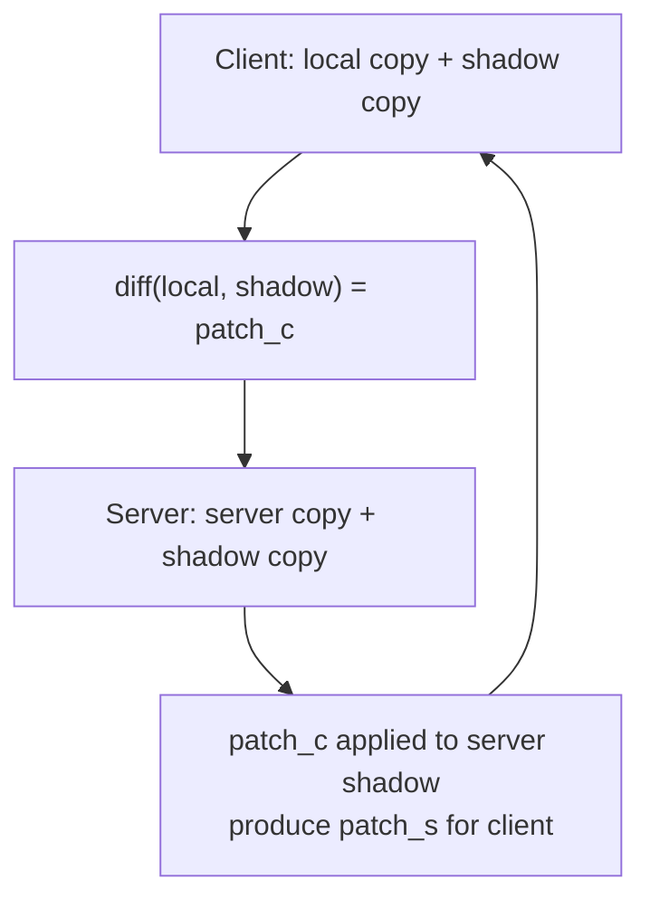

**Pros:** Simple to reason about, works with any diff algorithm, no special data structure needed.  
**Cons:** Requires reliable ordered delivery. Lossy diffs (e.g., move vs delete+insert) can lose intent. Not suitable for complex concurrent scenarios.

---

### 5. Event Sourcing / Append-Only Log

Instead of sharing state directly, share *events*. Every change is an immutable event appended to a log. The current state is always derived by replaying the log.

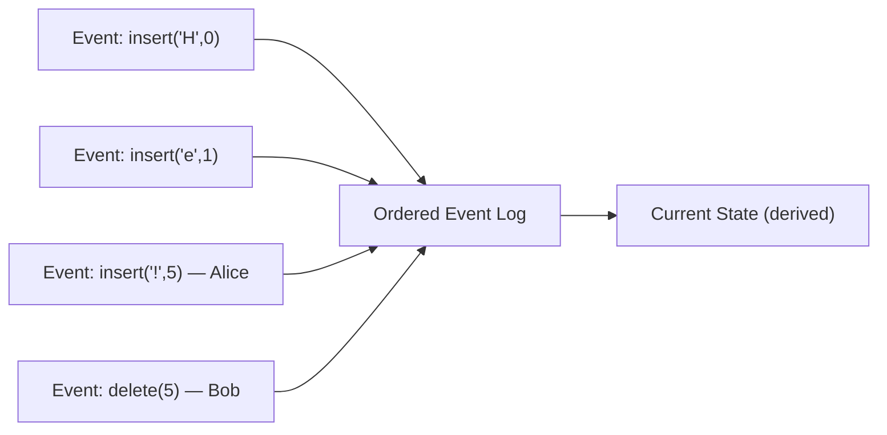

The server is the total-order authority for the log. Clients consume the log and rebuild state. Conflicts are defined by the ordering in the log.

**Used by:** Apache Kafka-backed systems, collaborative game backends, financial ledgers.

**Pros:** Full audit trail, replay, time-travel debugging, easy to add new subscribers.  
**Cons:** Log grows unboundedly without compaction. State rebuild from scratch is expensive; snapshots needed. The server still decides ordering — it's not truly peer-to-peer.

---

### 6. Client-Side Prediction + Server Reconciliation (Game Engines)

Used in real-time games like **Counter-Strike**. Not for text, but the same principles apply to any real-time collaborative simulation.

**The challenge:** A shooter firing at 60 fps cannot wait 100ms for server confirmation before rendering the shot. The game must *feel* instant.

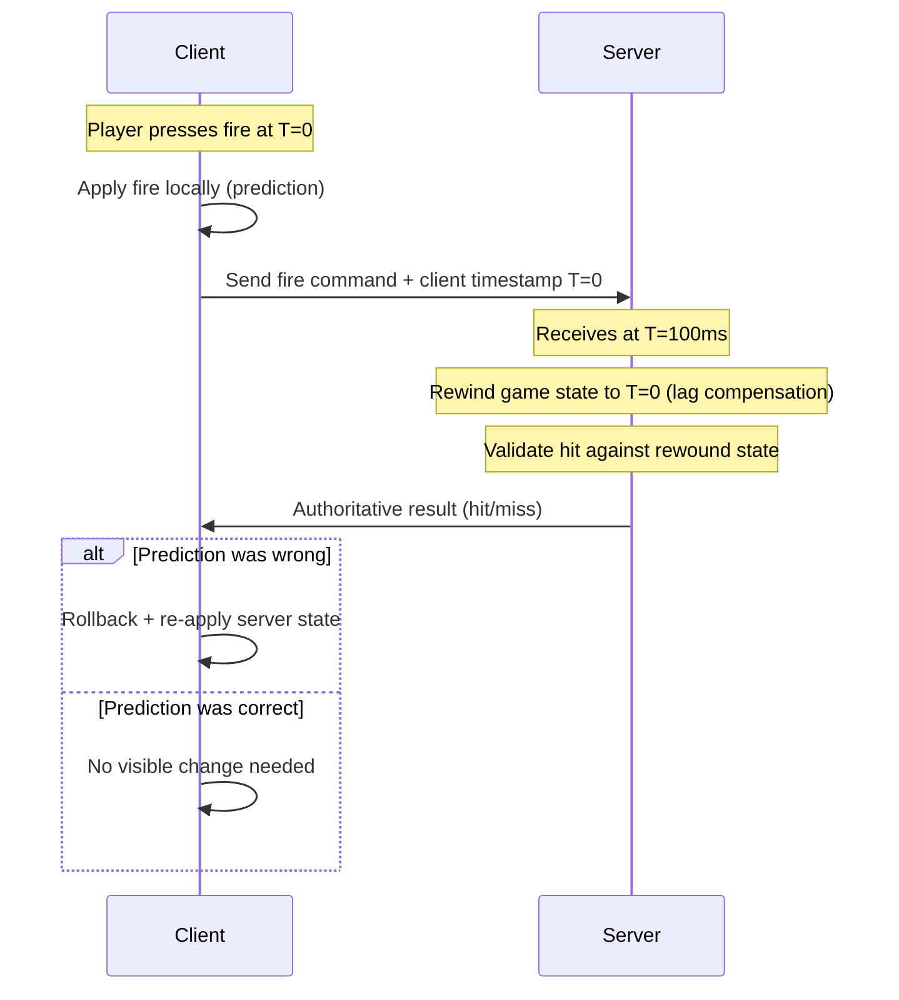

**Key techniques:**
- **Client-side prediction:** Apply input locally immediately, don't wait for server.
- **Lag compensation:** Server rewinds history to the client's timestamp before validating.
- **Entity interpolation:** Render other players slightly in the past (e.g., 100ms behind) to smooth movement.
- **Server reconciliation:** Client re-simulates all unacknowledged inputs on top of the server's authoritative state.

**Used by:** Valve Source Engine (CS:GO, CS2), Unreal Engine, Unity Netcode.

---

### Strategy Comparison

| Strategy | Convergence | Offline | P2P | Complexity | Best For |
|---|---|---|---|---|---|
| Last-Write-Wins | ✅ | ✅ | ✅ | Low | Presence, cursors |
| OT (centralized) | ✅ | Limited | ❌ | Medium | Text docs (Google Docs) |
| CRDT | ✅ | ✅ | ✅ | High | Offline-first, P2P |
| Differential Sync | ✅ | ❌ | ❌ | Low | Simple sync |
| Event Sourcing | ✅ (server order) | Limited | ❌ | Medium | Audit trail, replay |
| Client Prediction | Eventual | ❌ | ❌ | High | Real-time games |

---

## Presence and Awareness

Knowing *who else is editing* and *where their cursor is* is as important as conflict resolution for collaborative feel.

### Cursor and Selection Sharing

Cursors are **ephemeral** — they don't need the same guarantees as document content. LWW is fine.

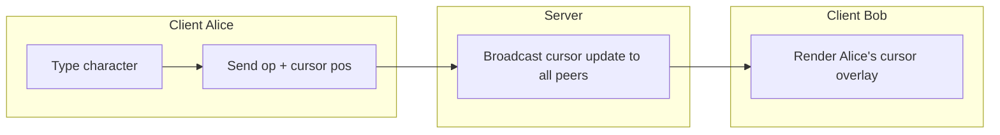

**Practical details:**
- Cursor positions must be expressed in **stable coordinates** (CRDT character IDs, or OT-transformed positions), not raw integer offsets that shift when others type.
- Selection ranges need a start ID and end ID.
- Throttle cursor broadcasts to ~50ms to avoid flooding.

### Awareness Protocol (Yjs approach)

Yjs uses a dedicated *Awareness* layer separate from the document CRDT. It propagates ephemeral state (cursor, username, color, online status) with heartbeat-based TTL. If a heartbeat stops, the peer is assumed gone.

---

## Offline Support

Offline support means users can keep editing without network connectivity, and changes merge when reconnected.

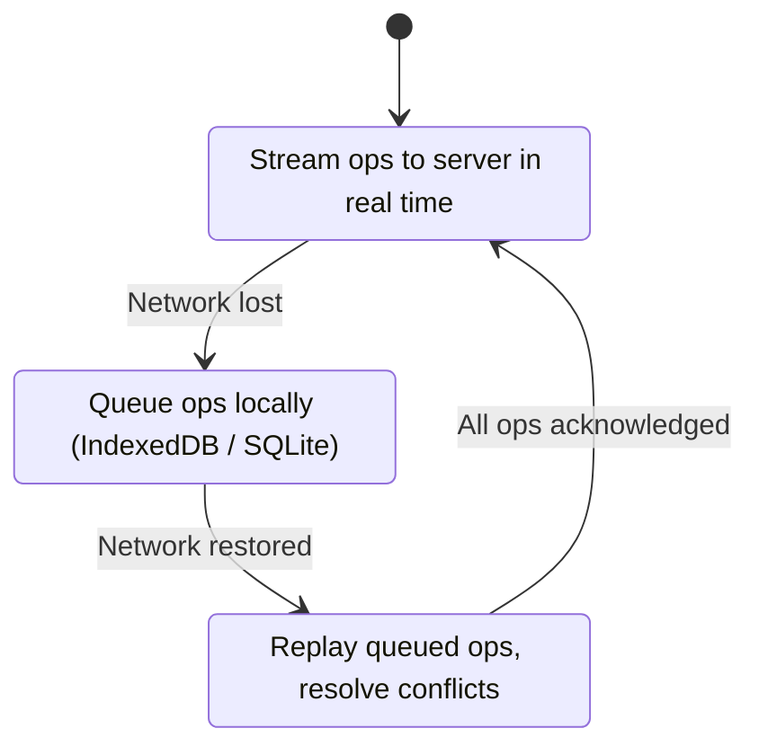

**Requirements for true offline support:**
- The data structure must be **mergeable without a central coordinator** (CRDT wins here; OT requires careful queuing).
- Local ops must be persisted (IndexedDB in browsers, SQLite on mobile).
- On reconnect, the client sends its log of unacknowledged operations, and the server (or peer) merges them.
- The UI must distinguish between *locally saved* and *synced to server*.

**Google Docs offline mode** stores a bounded recent history but reconnects by replaying OT operations — it relies on the central server for final ordering.

**Figma offline mode** relies on CRDTs (via their custom multiplayer engine) and can merge arbitrary diverged states.

---

## Transport and Network Layer

The choice of transport affects latency, battery life, and scalability.

| Transport | Latency | Server Push | Best For |
|---|---|---|---|
| **WebSocket** | ~10–30ms | ✅ | Text editing, presence |
| **WebRTC DataChannel** | ~5–15ms P2P | ✅ (P2P) | Games, P2P collaboration |
| **Server-Sent Events** | ~30ms | One-way | Read-heavy dashboards |
| **HTTP long polling** | ~100ms | Simulated | Legacy fallback |

For a collaborative document editor, **WebSocket** is standard. For a game or low-latency drawing tool, **WebRTC** (possibly via a Selective Forwarding Unit) gives the best latency.

### Selective Forwarding Unit (SFU) — How Zoom Handles Video

Zoom Video handles thousands of simultaneous video streams using an **SFU architecture**:

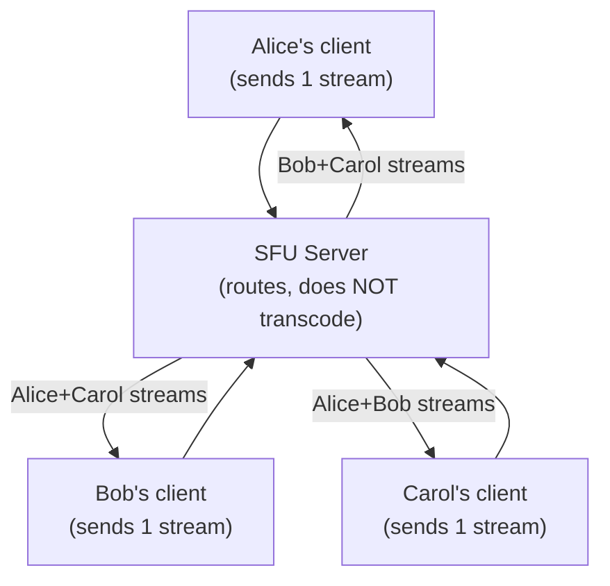

The SFU forwards encoded streams without decoding — CPU cost is O(n) not O(n²). Simulcast allows each sender to send 3 quality tiers; the SFU picks the right tier per receiver based on bandwidth.

---

## Real-World Examples

### Google Docs — OT at Scale

Google Docs uses a **centralized OT** model (derived from the Jupiter protocol). The server is the single source of truth for operation ordering.

- Every document has a *revision counter*.
- Clients send ops tagged with the revision they were based on.
- The server transforms incoming ops against all ops that arrived since that revision, applies them, increments the revision, and broadcasts the transformed op to all clients.
- Rich-text changes (bold, headers) are modeled as additional operation types with their own transform rules.
- Presence (cursor, name, color) is managed via a separate presence service.

**Why not CRDT?** Google Docs predates mature CRDT libraries. OT on a single server is simpler to reason about than distributed CRDT. Migrating 3 billion documents is also a significant constraint.

---

### Counter-Strike — Client Prediction + Lag Compensation

CS:GO / CS2 runs at **64 or 128 ticks per second** (16ms or 8ms server updates). Every player is technically looking at a slightly different, slightly delayed view of the game world.

- The client predicts its own movement instantly.
- The server validates shots by rewinding the game state to the shooter's client time, checking if the target was actually in the hit position at that moment.
- This makes the game feel responsive even at 80ms ping, at the cost of occasionally letting bullets hit targets that have already moved (in absolute time).

**Lesson for collaborative tools:** Optimistic local application + authoritative server reconciliation is a broadly applicable pattern, not just for games.

---

### Pivotal Tracker — Simple Collaborative Backlog

Pivotal Tracker (now retired) used a much simpler model because stories in a backlog are naturally **coarse-grained** discrete objects.

- Each story card is an independent entity with a version number.
- Concurrent edits to the *same field* of the *same card* were rare and handled by LWW with a visible "someone else changed this" notification.
- Moving stories between columns used server-authoritative ordering.
- No OT or CRDT needed — the domain made conflicts unlikely.

**Lesson:** Choose the simplest conflict strategy that fits your domain. Not every collaborative tool needs OT or CRDT.

---

### Zoom Whiteboard — What Not to Do

Zoom Whiteboard is notoriously slow and laggy. The main issues:

- **Operations are round-tripped through the server before rendering locally** — no client-side prediction. You draw a line and see it appear ~300ms later.
- **No offline support** — losing connection loses your work.
- **Shapes are serialized through a slow pipeline**, causing visible lag even on fast connections.

**Lesson:** For anything that involves freehand drawing or real-time pointer tracking, you *must* apply locally first and sync asynchronously. Waiting for server acknowledgment before rendering is a fundamental UX failure.

---

## System Design: Collaborative Drawing Tool

*Scenario: Many users drawing on a shared infinite canvas (like draw.io, Excalidraw, or Miro).*

### Data Model

The canvas state is a **list of shapes** (rectangles, lines, paths, text boxes), each with:
- A globally unique ID (UUID)
- An owner + last-modifier
- Geometric properties (x, y, width, height, path data)
- Z-order (layer index)

Shapes are independent — concurrent edits to *different shapes* never conflict. Concurrent edits to the *same shape* are rare and can be handled with per-shape versioning.

### Conflict Strategy

Use **CRDT-inspired per-object LWW with vector clocks**:

- Each shape has a `version` vector clock `{siteId: counter}`.
- Concurrent moves of the same shape: LWW wins by wall clock + site ID tiebreak.
- Concurrent delete + move: delete wins (treat delete as tombstone).
- Drawing new shapes: never conflicts (new UUIDs).

Freehand strokes are append-only — each stroke point is an event appended to the shape's point log.

### Architecture

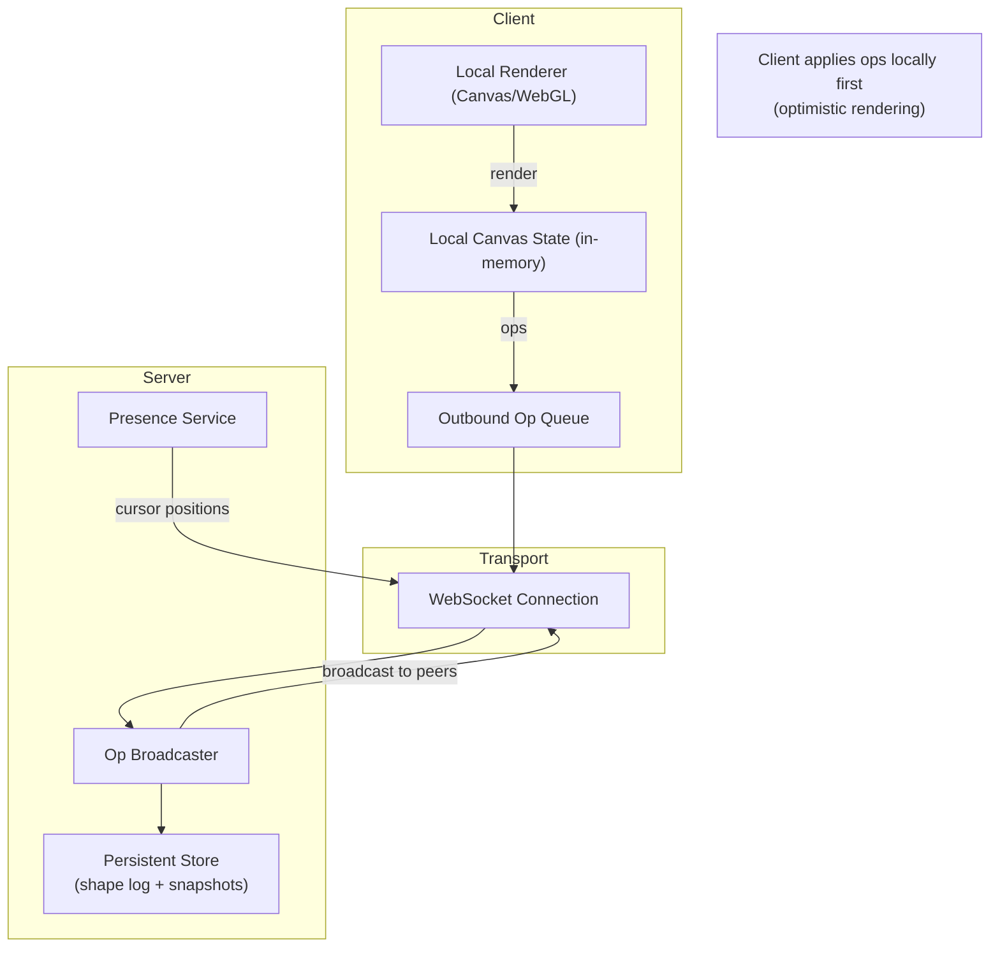

**Key decisions:**

1. **Optimistic rendering** — shapes appear on your canvas immediately, sync happens asynchronously.
2. **Cursor positions** broadcast at 50ms throttle via a separate presence channel, using LWW.
3. **Snapshots** every N minutes to avoid replaying the full event log on join.
4. **Infinite canvas** uses spatial partitioning — load only shapes in the current viewport.
5. **Selection locking** — optionally soft-lock a shape while you're dragging it (show other users "Alice is moving this").

### Handling Freehand Strokes

Freehand strokes need special treatment because they generate 60+ events per second:

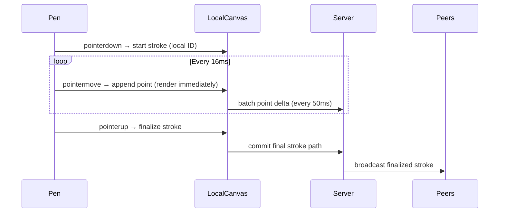

Points are batched and compressed (delta encoding, Ramer–Douglas–Peucker simplification). Only the final stroke is persisted; intermediate points are ephemeral.

---

## System Design: Collaborative Document Editor

*Scenario: A Confluence-like wiki where multiple users edit the same article simultaneously and see each other's changes in real time.*

### Data Model

A rich-text document is modeled as a **tree of nodes**: paragraphs, headings, lists, code blocks, tables. Each node is identified by a stable ID.

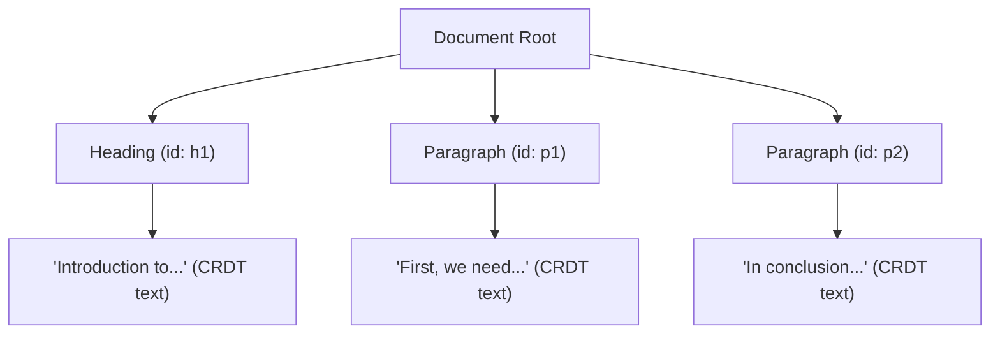

- **Block-level structure** (node order, nesting) uses a **sequence CRDT** (e.g., Yjs `Y.Array`).
- **Inline text** within each block uses a **text CRDT** (e.g., Yjs `Y.Text` backed by RGA).
- **Formatting** (bold, italic, links) uses character-level attributes stored as CRDT maps.

### Architecture

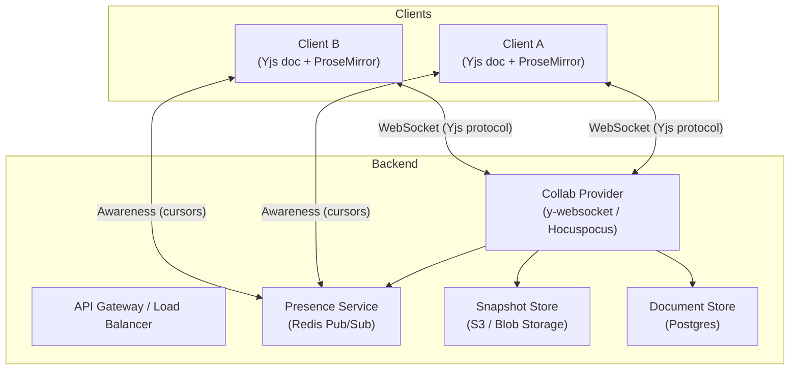

**Component responsibilities:**

| Component | Role |
|---|---|
| **Yjs** (client) | CRDT engine — tracks document state, merges updates |
| **ProseMirror** (client) | Rich-text editor UI — binds to Yjs state |
| **y-websocket / Hocuspocus** | Server-side Yjs sync provider — routes updates, persists state |
| **Awareness (Yjs)** | Ephemeral cursor/presence state with heartbeat TTL |
| **Snapshot Store** | Periodic binary snapshots of Yjs doc state (avoid full replay) |
| **Postgres** | Stores document metadata, access control, version history |

### Sync Flow

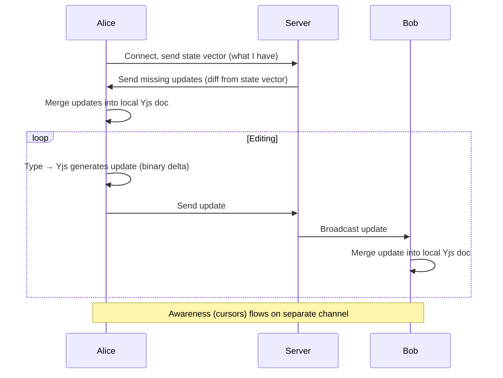

### Offline + Reconnect

1. While offline, all edits accumulate in the local Yjs document (persisted to IndexedDB).
2. On reconnect, client sends its **state vector** — a compact summary of what updates it has.
3. Server responds with only the **missing updates** since that vector.
4. Client merges in all remote changes. Since this is CRDT, the merge is deterministic and correct regardless of how long the client was offline.
5. Conflicts (e.g., both users restructured the same paragraph) are visible in the document — no silent data loss.

### Multi-User Cursor Rendering

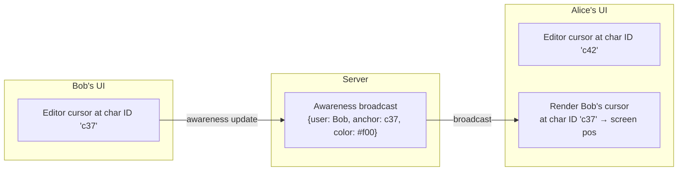

Cursors reference **CRDT character IDs**, not integer positions. The editor translates IDs to screen positions using the current document view.

---

## Putting It All Together

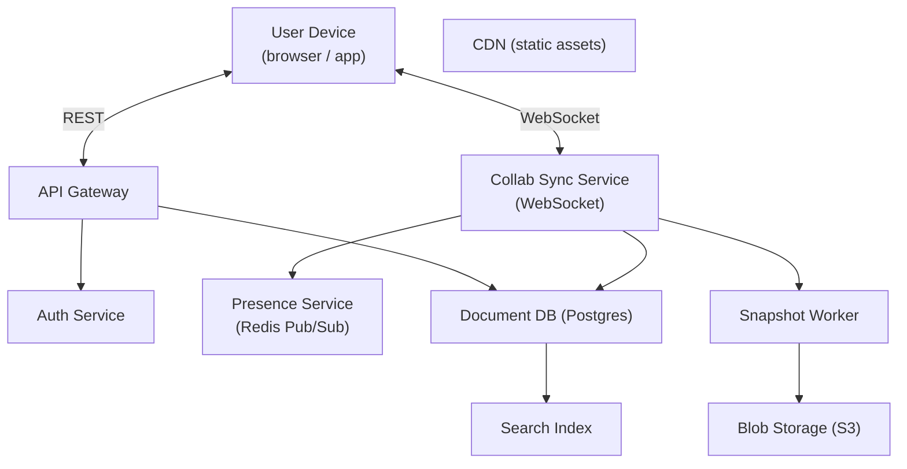

**Scaling considerations:**

- **Collab Sync Service** must be sticky per document (all editors of doc X connect to the same node, or nodes share state via Redis/Kafka).
- **Presence** scales horizontally via Redis Pub/Sub — O(1) broadcast per document channel.
- **Snapshot Worker** runs periodically (e.g., every 5 minutes of inactivity) to compact the CRDT log.
- **Read replicas** serve document loads; writes go to primary.

---

## Interview Cheat Sheet

| Question | Answer |
|---|---|
| OT vs CRDT for text? | OT simpler with central server; CRDT better for offline/P2P |
| How do cursors stay accurate? | Use stable character IDs, not integer positions |
| How does offline sync work? | Queue ops locally, replay on reconnect; CRDT merges cleanly |
| How to scale WebSocket connections? | Sticky sessions per doc; Redis Pub/Sub for cross-node broadcast |
| Why does Zoom Whiteboard feel slow? | No client-side prediction — waits for server before rendering |
| How does CS:GO feel responsive at 80ms ping? | Client-side prediction + server reconciliation |
| When is LWW enough? | For ephemeral state: cursors, presence, non-critical overwrites |
| What library implements CRDT for browsers? | Yjs (most popular), Automerge |

---

## Further Reading and Watching

### Must-Watch Videos

- **[Conflict Resolution in Collaborative Editing — Martin Kleppmann (Strange Loop 2019)](https://www.youtube.com/watch?v=yCcWpzY8dIA)** — The best single talk on OT vs. CRDT with clear visual examples.
- **[CRDTs: The Hard Parts — Martin Kleppmann (Hydra 2020)](https://www.youtube.com/watch?v=x7drE24geUw)** — Deep dive into where CRDTs get tricky (move, undo, rich text).
- **[Source Multiplayer Networking — Valve Developer Wiki (video)](https://developer.valvesoftware.com/wiki/Source_Multiplayer_Networking)** — The definitive resource on lag compensation and client prediction.
- **[Building Figma's Multiplayer — Figma Engineering Blog (talk)](https://www.youtube.com/watch?v=LA3VgWHOhL8)** — How Figma rebuilt its sync engine around CRDTs.

### Essential Articles

- **[Operational Transformation FAQ — Chengzheng Sun](https://www3.ntu.edu.sg/scse/staff/czsun/projects/otfaq/)** — Comprehensive OT reference.
- **[A CRDT Primer — Lars Hupel](https://lars.hupel.info/topics/crdt/01-intro/)** — Gentle introduction to state-based CRDTs.
- **[Yjs Documentation](https://docs.yjs.dev/)** — The go-to production CRDT library for collaborative web apps.
- **[An Introduction to Conflict-Free Replicated Data Types — Conflict Free](https://crdt.tech/)** — curated CRDT papers and implementations.
- **[Differential Synchronization — Neil Fraser (Google)](https://neil.fraser.name/writing/sync/)** — Original paper with good diagrams.
- **[How Figma's Multiplayer Technology Works](https://www.figma.com/blog/how-figmas-multiplayer-technology-works/)** — Practical decisions from a production system.
- **[Google Docs: The Mechanics of Real Time Collaboration](https://drive.googleblog.com/2010/09/whats-different-about-new-google-docs.html)** — High-level description of the OT model.
- **[Linear's Sync Engine](https://linear.app/blog/scaling-the-linear-sync-engine)** — How Linear (project management) built a fast offline-first sync engine.

### Papers

- **[Designing Real-Time Group Editors (Ellis & Gibbs, 1989)](https://dl.acm.org/doi/10.1145/67544.66963)** — The original OT paper.
- **[Logoot: A Scalable Optimistic Replication Algorithm for Collaborative Editing (Weiss et al., 2009)](https://inria.hal.science/inria-00432368)** — Position-based CRDT for text.
- **[A Comprehensive Study of CRDTs (Shapiro et al., 2011)](https://inria.hal.science/inria-00555588)** — The formal CRDT taxonomy paper.
